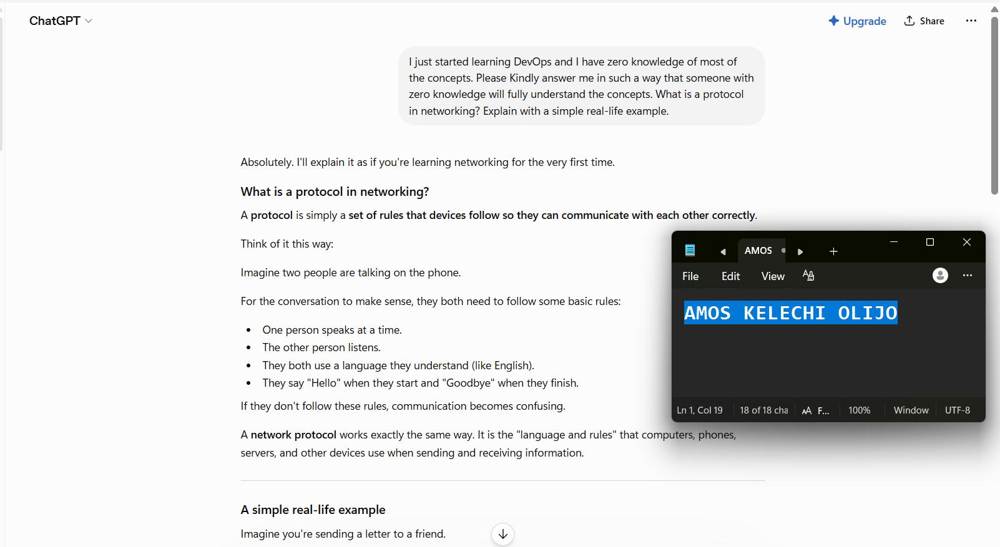
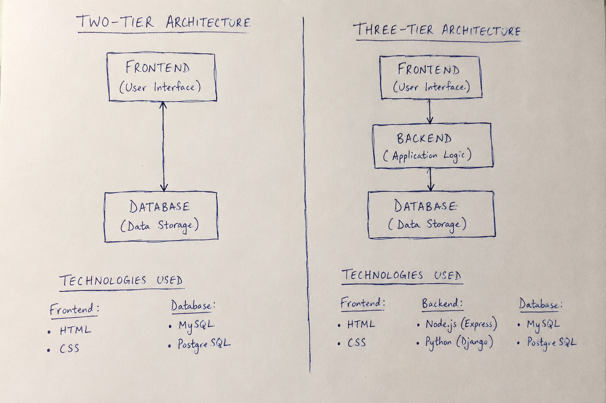
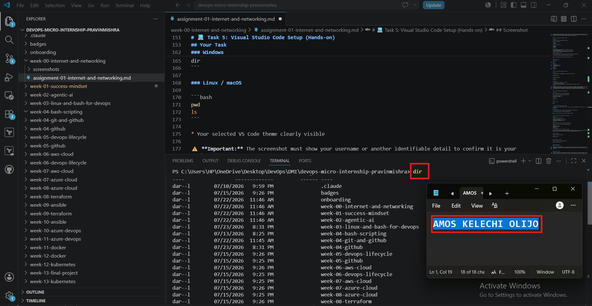

# Week 00 - Internet and Networking

Part of the DevOps Micro Internship (DMI) Cohort 3 with Agentic AI

---

# 🧑‍💻 Task 1: Using ChatGPT as Your Learning Assistant

## Scenario

You're new to DevOps and will frequently encounter technical questions. ChatGPT can be your learning companion.

## Your Task

Write a clear ChatGPT prompt to help you understand:

> "What is a protocol in networking? Explain with a simple real-life example."

Take a screenshot of your interaction showing:

* Your detailed prompt (with clear expectations)
* ChatGPT's simplified response with an example

## Screenshot

Save your screenshot in the `screenshots` folder and update the file name below.




Replace `task-1-chatgpt.png` with your actual screenshot file name.

---

## What I Learned (2–3 lines)

Using ChatGPT as a learning assistant showed me that asking clear and detailed questions leads to better explanations. I also learned that ChatGPT can simplify technical concepts by using relatable real-life examples, making it easier to understand new DevOps topics.


---

# 🌐 Task 2: Internet and Networking

## Scenario

Your friend is launching an online bookstore named **EpicReads**.

He asked you to explain how users globally can access his website hosted in Finland.

## Your Task

Write a short explanation (**100–150 words**) that includes:

* Packet Switching
* IP Address
* TCP/IP
* HTTP/HTTPS

💡 **Tip:** You may use ChatGPT (as demonstrated in Task 1) to refine your explanation.

## Answer

When a user visits EpicReads, their request is broken into small units called packets, which travel across the internet through different routes until they reach the server in Finland. The server has a unique IP address that identifies its location on the network. Communication between the user's device and the server follows the TCP/IP protocol suite, where TCP ensures that all packets are delivered accurately and in the correct order, while IP handles the addressing and routing of those packets. Once the request reaches the server, HTTP or the more secure HTTPS protocol is used to transfer the website's content back to the user's browser. HTTPS encrypts the communication, protecting sensitive information such as login credentials and payment details during transmission.

---

# 🏗️ Task 3: Application Architecture & Stack

## Scenario

EpicReads bookstore has two application versions:

### Two-Tier Application

* Frontend
* Database

### Three-Tier Application

* Frontend
* Backend
* Database

## Your Task

* Draw simple diagrams (hand-drawn or tool-based such as draw.io)
* Label each layer clearly
* List at least two common technologies or tools used for each layer
* Submit a screenshot or photo clearly showing your own drawing

## Diagram Screenshot / Photo

Save your diagram image in the `screenshots` folder and update the file name below.




Replace `task-3-diagram.png` with your actual diagram file name.

---

## Technologies Used

### Frontend

* HTML
* CSS

### Backend

* Node.js(Express.js)
* Python(Django or Flask)

### Database

* MySQL
* PostgreSQL

---

# 🌍 Task 4: Domain Name & DNS (Basic Concepts)

## Scenario

Your friend's bookstore **EpicReads** is currently accessible through:

```text
52.172.142.222:3000
```

He purchased the domain:

```text
epicreads.com
```

## Your Task

In **50–100 words**, explain in your own words:

1. What is DNS (Domain Name System)?
2. Which DNS record type should be used to connect the domain to the given IP, and why?

## Answer

The Domain Name System (DNS) is like the internet's phonebook. It translates a human-friendly domain name, such as epicreads.com, into the server's IP address so users do not have to remember numerical addresses.
 To connect the domain to the server at 52.172.142.222, an A (Address) record should be created because it maps a domain name directly to an IPv4 address, allowing browsers to locate and access the website correctly.

---

# 💻 Task 5: Visual Studio Code Setup (Hands-on)

## Your Task

Install Visual Studio Code (if not already installed).

Take a screenshot of your VS Code environment showing:

* Terminal open inside VS Code
* Running a basic command:

### Windows

```powershell
dir
```

### Linux / macOS

```bash
pwd
ls
```

* Your selected VS Code theme clearly visible

⚠️ **Important:** The screenshot must show your username or another identifiable detail to confirm it is your environment.

## Screenshot

Save your screenshot in the `screenshots` folder and update the file name below.




Replace `task-5-vscode.png` with your actual screenshot file name.

---

# 🔗 Task 6: Publish Your Assignment as a LinkedIn Post

## Objective

Publishing on LinkedIn helps you:

* Build your professional online presence
* Reinforce your learning
* Document your DevOps journey publicly

## Your Task

Summarize your answers from Tasks 1–5 into a LinkedIn post.

Clearly structure your post into the following sections:

* ChatGPT
* Internet & Networking
* App Architecture
* DNS
* VS Code Setup

Add the following credit note at the end of your post:

> **P.S. This post is part of the DevOps Micro Internship (DMI) with Agentic AI — Cohort 3 — by Pravin Mishra. My graded progress is public: https://dmi.pravinmishra.com/s/YOUR-GITHUB-USERNAME.html · Start your DevOps journey: https://dmi.pravinmishra.com/?utm_source=student&utm_medium=ps-linkedin&utm_campaign=cohort3**

---

## LinkedIn Post URL

https://www.linkedin.com/posts/amosolijo_devops-learninginpublic-cloudcomputing-activity-7486691857645699072-M9_R?utm_source=share&utm_medium=member_desktop&rcm=ACoAACeeKxUBHCmo50w2w4CI7SAJd2ZqQPhPsCQ


---

## LinkedIn Post Backup Copy

Paste the full text of your LinkedIn post here:

Going Back to Strengthen My DevOps Foundation – Week 0 Completed

Although I'm currently progressing through Week 4 of the DevOps Micro Internship (DMI) – Agentic AI Cohort 3, I realized I hadn't documented my Week 0 assignment. Rather than skip it, I decided to go back and complete it because strong fundamentals are essential for everything that follows in DevOps.

Here's what I learned during Week 0:

🤖 Using ChatGPT as a Learning Assistant

I learned how to write clear and effective prompts that produce better explanations. One of the concepts I explored was network protocols, and using simple real-life examples made it much easier to understand.

🌐 Internet & Networking

I gained a better understanding of how websites are accessed across the internet. I learned about:

Packet Switching

IP Addresses

TCP/IP

HTTP vs HTTPS and why secure communication matters

🏗️ Application Architecture

I compared Two-Tier and Three-Tier application architectures and learned the role of each layer:

Frontend

Backend

Database

I also became familiar with technologies commonly used in each layer, such as HTML, CSS, Node.js, Python, MySQL, and PostgreSQL.

🌍 DNS Basics

I learned how the Domain Name System (DNS) translates domain names into IP addresses and why an A Record is used to point a domain to an IPv4 address.

💻 Development Environment

I verified my Visual Studio Code setup, explored the integrated terminal, and ensured my development environment was ready for the hands-on tasks that followed in later weeks.

Looking back, Week 0 gave me the networking and system fundamentals that have made the later weeks much easier to understand. I'm glad I took the time to revisit it instead of leaving a gap in my learning journey.

Now it's time to continue building on that foundation as I progress through the rest of the internship.

I remain grateful to my mentor, Pravin Mishra, our lead co-mentor, Anjana Muthunayake, co-mentor Joy Ukpabi, and other co-mentors for this wonderful opportunity and clarifications of DevOps concepts, and the hands-on.

#DevOps #LearningInPublic #CloudComputing #Networking #DNS #TCPIP #VSCode #AgenticAI #BuildInPublic #CareerGrowth #OpenToLearn

P.S. This post is a part of DevOps Micro Internship with Agentic AI Cohort-3 by Pravin Mishra. You can start your DevOps journey by joining this Discord community: https://lnkd.in/dPjTW6wX

---

# Reflection – Week 0

### What did you find easy?

I found it easy to understand the basic networking concepts because they can be related to everyday activities such as sending letters and making phone calls. Using ChatGPT to clarify unfamiliar terms also made learning faster and more interactive.


---

### What was difficult?

The most challenging part was understanding how multiple networking concepts such as packet switching, TCP/IP, IP addresses, and HTTP/HTTPS work together behind the scenes. I had to read and practice several examples before the complete process became clear.


---

### What will you improve next week?

Next week, I plan to spend more time practicing the hands-on tasks instead of only reading about the concepts. I also want to improve my understanding of Linux commands and networking fundamentals, as they are essential skills for a DevOps engineer.


---

## 📌 About DMI & CloudAdvisory

DevOps Micro Internship (DMI) is a project-based DevOps program run by Pravin Mishra (The CloudAdvisory) focused on real-world execution, systems thinking, and career readiness.

It helps learners build strong DevOps foundations with hands-on experience.


## 📌 Resources

- 🌐 **DMI Official Website:** https://pravinmishra.com/dmi  
- 🎓 **DevOps for Beginners (Udemy):** https://www.udemy.com/course/devops-for-beginners-docker-k8s-cloud-cicd-4-projects/  
- 🎓 **Ultimate Agentic AI DevOps with Clude Code** https://www.udemy.com/course/ultimate-agentic-ai-devops-with-claude-code/?referralCode=448389767BC96284087B
- 🎓 **DevOps with Claude Code: Terraform, EKS, ArgoCD & Helm** https://www.udemy.com/course/devops-with-claude-code-terraform-eks-argocd-helm/?referralCode=1C5B734505D65A010FA3
- ▶️ **YouTube Playlist (DMI Cohort 3):** https://www.youtube.com/playlist?list=PLFeSNDtI4Cho  
- 🔗 **Pravin Mishra (LinkedIn):** https://www.linkedin.com/in/pravin-mishra-aws-trainer/  
- 🏢 **CloudAdvisory (LinkedIn):** https://www.linkedin.com/company/thecloudadvisory/

---

*This submission is part of DevOps Micro Internship (DMI) Cohort 3 — Agentic AI Track*