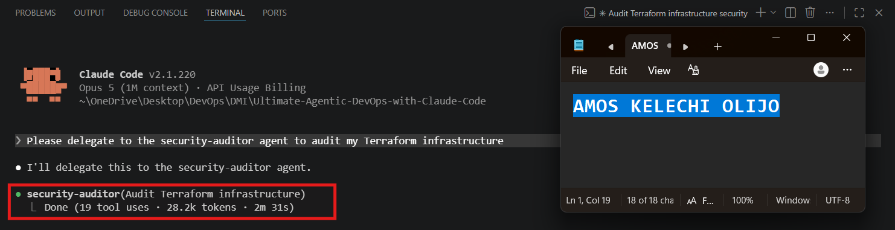
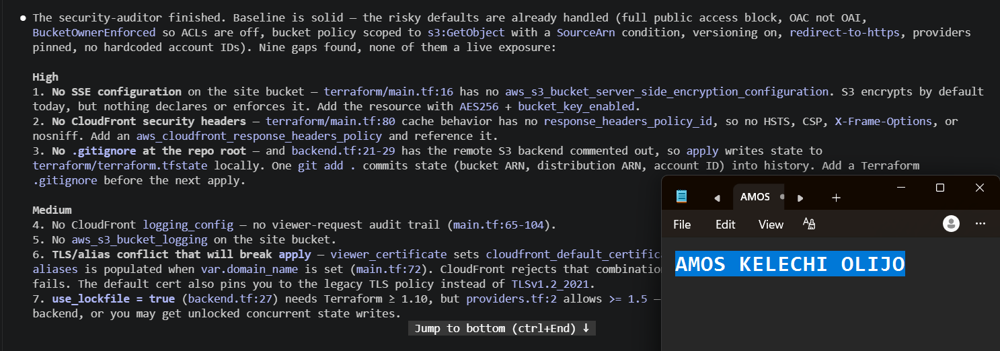
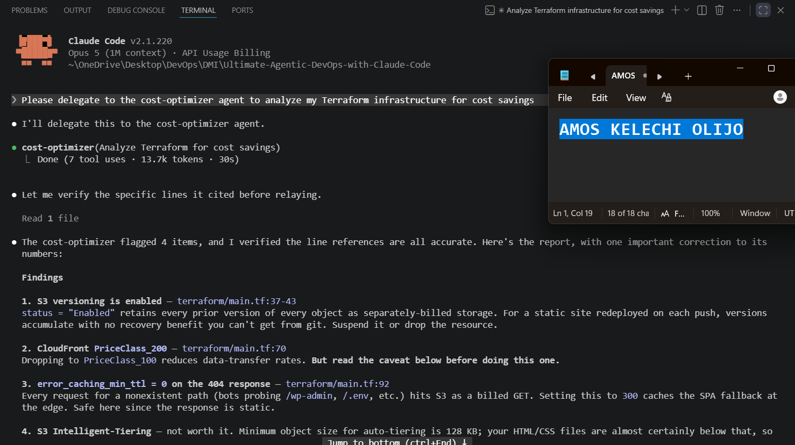
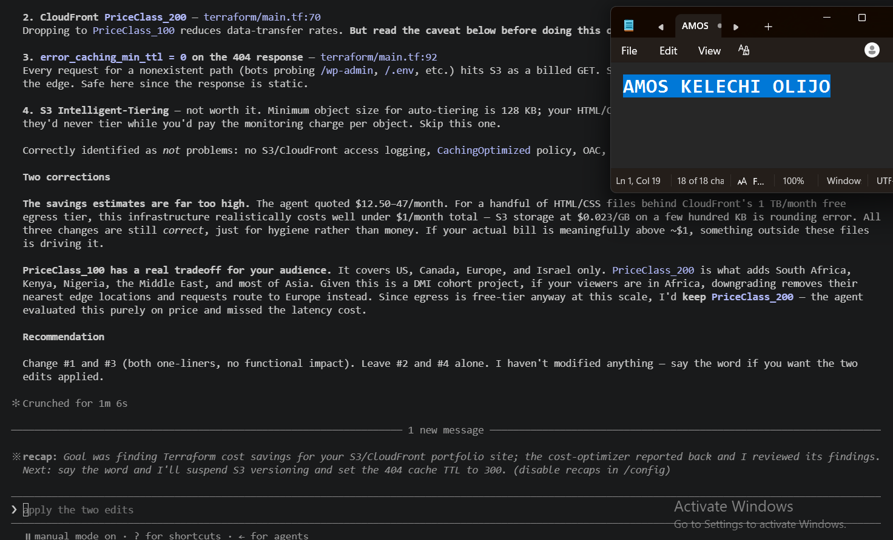

# Assignment 4 — Building Your AI Team

Part of the DevOps Micro Internship (DMI) Cohort 3 with Agentic AI

---

## Purpose

In this assignment, you will build and configure a set of specialized AI subagents inside your project. You will learn how different models and tool permissions define agent behavior, and you will trigger two real agent delegations to analyze security and cost aspects of your Terraform infrastructure.

---

# Task 1 — Create the Agents Folder and Add Files

## Goal

Create the `.claude/agents/` directory and add all required agent files.

### Evidence

#### Screenshot 1 — VS Code sidebar showing `.claude/agents/` with all 3 files

---

# Task 2 — Compare the Agent Configurations

## Goal

Analyze the configuration differences between the three agents and demonstrate understanding of model and tool selection.

### Written Answers

#### 1. Why does the cost optimizer use Haiku instead of Sonnet?

The cost optimizer uses claude-haiku-4-5 because cost analysis is a pattern-matching and read-only task — it scans files and applies known rules to flag expensive configurations. Haiku is faster and cheaper while being fully capable of this kind of structured analysis. Sonnet is reserved for more complex reasoning tasks like security auditing, where nuanced judgment about risk severity is needed. Using Haiku here also demonstrates good agent design: match the model to the complexity of the task, not the most powerful model available.

---

#### 2. Why does the security auditor NOT have Write in its tools list?

The security auditor is intentionally read-only (Read, Grep, Bash) because its job is to observe and report — never to change anything. Giving a security scanner Write access would be dangerous: it could accidentally modify infrastructure files while scanning them, or an agentic loop could trigger unintended changes. Separating the auditor (read) from the writer (write) is a core principle of least privilege — each agent only gets the permissions it strictly needs to do its job.

---

#### 3. Why does the tf-writer use `inherit` instead of a specific model?

The tf-writer uses inherit so it automatically uses whatever model the parent Claude session is running on. This makes the agent flexible and future-proof — if the main session is upgraded to a more capable model, the tf-writer benefits without needing its config updated. It also makes sense because the tf-writer is tightly coupled to the main workflow: it needs to match the reasoning capability of whoever is directing it, so inheriting the parent model keeps them in sync.

---

### Evidence

#### Screenshot 2 — `security-auditor.md` frontmatter showing model and tools configuration

---

#### Screenshot 3 — `cost-optimizer.md` frontmatter showing the model and tools configuration

---

# Task 3 — Run the Security Auditor

## Goal

Trigger the security auditor agent and analyze the generated security report for your Terraform infrastructure.

### Evidence

#### Screenshot 4 — The delegation message showing Claude launched the security-auditor

---

#### Screenshot 5 — Security audit report output

---

# Task 4 — Run the Cost Optimizer

## Goal

Trigger the cost optimizer agent and review the generated cost optimization report.

### Evidence

#### Screenshot 6 — The full cost optimization report

---

# Submission Instructions

- Ensure all agent files are committed in `.claude/agents/`
- Complete all written answers in your GitHub Repo
- Push final changes to your forked GitHub repository

---

## GitHub Repository URL

`https://github.com/amoskelechi/Ultimate-Agentic-DevOps-with-Claude-Code`

---

# Completion Checklist

- [x] `.claude/agents/` folder contains all 3 agent files
- [x] Screenshot 2 shows correct `security-auditor.md` configuration
- [x] Screenshot 3 shows correct `cost-optimizer.md` configuration
- [x] All 3 written answers completed 
- [x] Security auditor executed successfully
- [x] Cost optimizer executed successfully
- [x] Security report is visible with findings
- [x] Cost report is visible with recommendations
- [x] All required screenshots added
- [x] GitHub repo updated with agents

---

## 📌 About DMI & CloudAdvisory

DevOps Micro Internship (DMI) is a project-based DevOps program run by Pravin Mishra (The CloudAdvisory) focused on real-world execution, systems thinking, and career readiness.

It helps learners build strong DevOps foundations with hands-on experience.

---

## 📌 Resources

- 🌐 DMI Official Website: https://dmi.pravinmishra.com?utm_source=github&utm_medium=readme  
- 🎓 University: https://university.pravinmishra.com?utm_source=github&utm_medium=readme  
- 💬 Discord Community: https://discord.pravinmishra.com?utm_source=github&utm_medium=readme  
- 📝 Blog: https://dmi.pravinmishra.com/blog?utm_source=github&utm_medium=readme  
- ▶️ YouTube Playlist: https://www.youtube.com/playlist?list=PLFeSNDtI4Cho  
- 🔗 Pravin Mishra (LinkedIn): https://www.linkedin.com/in/pravin-mishra-aws-trainer/  
- 🏢 CloudAdvisory (LinkedIn): https://www.linkedin.com/company/thecloudadvisory/

---

*This submission is part of DevOps Micro Internship (DMI) Cohort 3 — Agentic AI Track.*