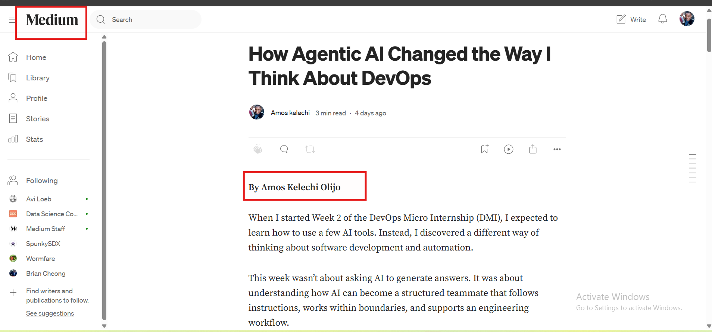
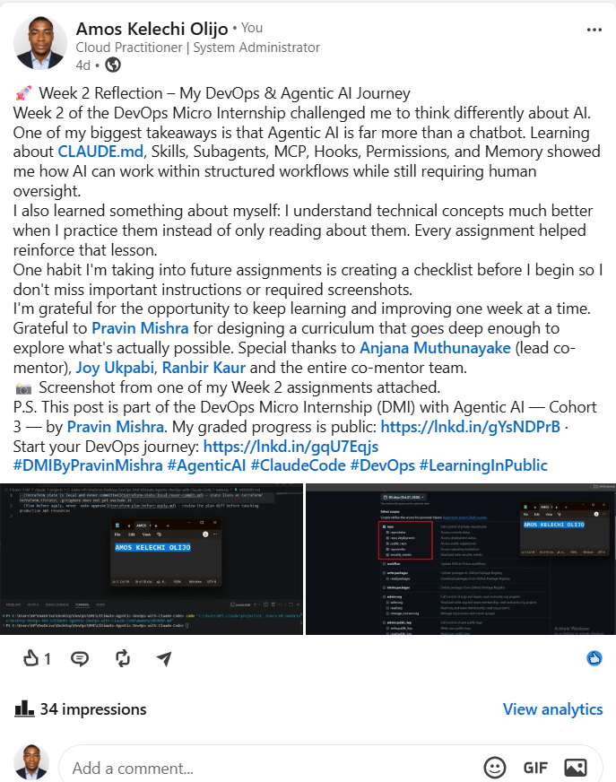

# Assignment 8 — Week 2 Reflection Blog

Part of the DevOps Micro Internship (DMI) Cohort 3 with Agentic AI

---

# Purpose

In this assignment, you will reflect on your Week 2 learning journey and write a short blog capturing your experience working with Agentic AI tools such as Claude Code, Skills, Subagents, MCP, Hooks, Permissions, and Memory.

You will also publish a LinkedIn post summarizing your learning and share both links for evaluation.

---

# Task 1 — Write Your Reflection Blog

## Goal

Write a reflection blog covering your Week 2 learning experience.

### Blog Requirements

Your blog must include:

* Title: **Reflection – Week 2**
* Minimum 300 words
* At least 2–3 topics from Week 2 (Claude Code, Skills, Subagents, MCP, Hooks, Permissions, Memory)
* Honest personal reflection (learning, challenges, mindset)
* One habit/system you plan to implement
* Your full name clearly visible

### Allowed Platforms

You can publish your blog on:

* Hashnode
* Medium
* Dev.to
* LinkedIn Article
* GitHub Markdown file
* Substack

---

### Evidence

#### Screenshot 1 — Blog published and visible

---

### Submission Field

Blog Link:

`https://medium.com/@amoskelechukwu/how-agentic-ai-changed-the-way-i-think-about-devops-b97ad088f99d?sharedUserId=amoskelechukwu`

---

# Task 2 — Create LinkedIn Post

## Goal

Share your Week 2 learning publicly on LinkedIn.

---

### LinkedIn Post Requirements

Your post must include:

* One screenshot from any Week 2 assignment
* Short reflection (what you learned or built)
* Required P.S. line exactly as given below

---

### Required P.S. Line (Must Include Exactly)

> **P.S. This post is part of the DevOps Micro Internship (DMI) with Agentic AI — Cohort 3 — by [Pravin Mishra](https://www.linkedin.com/in/pravin-mishra-aws-trainer/). My graded progress is public: https://dmi.pravinmishra.com/s/YOUR-GITHUB-USERNAME.html · Start your DevOps journey: https://dmi.pravinmishra.com/?utm_source=student&utm_medium=ps-linkedin&utm_campaign=cohort3**

---

### Suggested Hashtags

#DMIByPravinMishra #AgenticAI #ClaudeCode #DevOps #LearningInPublic

---

### Evidence

#### Screenshot 2 — LinkedIn post published

---

### Submission Field

🚀 Week 2 Reflection – My DevOps & Agentic AI Journey
Week 2 of the DevOps Micro Internship challenged me to think differently about AI.
One of my biggest takeaways is that Agentic AI is far more than a chatbot. Learning about CLAUDE.md, Skills, Subagents, MCP, Hooks, Permissions, and Memory showed me how AI can work within structured workflows while still requiring human oversight.
I also learned something about myself: I understand technical concepts much better when I practice them instead of only reading about them. Every assignment helped reinforce that lesson.
One habit I'm taking into future assignments is creating a checklist before I begin so I don't miss important instructions or required screenshots.
I'm grateful for the opportunity to keep learning and improving one week at a time.
Grateful to Pravin Mishra for designing a curriculum that goes deep enough to explore what's actually possible. Special thanks to Anjana Muthunayake (lead co-mentor), Joy Ukpabi, Ranbir Kaur and the entire co-mentor team.
📸 Screenshot from one of my Week 2 assignments attached.
P.S. This post is part of the DevOps Micro Internship (DMI) with Agentic AI — Cohort 3 — by Pravin Mishra. My graded progress is public: https://lnkd.in/gYsNDPrB · Start your DevOps journey: https://lnkd.in/gqU7Eqjs
#DMIByPravinMishra #AgenticAI #ClaudeCode #DevOps #LearningInPublic

---

### LinkedIn Post Link:

`https://www.linkedin.com/posts/amosolijo_dmibypravinmishra-agenticai-claudecode-ugcPost-7488273485295878145-yBzt/?utm_source=share&utm_medium=member_desktop&rcm=ACoAACeeKxUBHCmo50w2w4CI7SAJd2ZqQPhPsCQ`

---

# Submission Instructions

* Blog must be publicly accessible
* LinkedIn post must be visible (public or unlisted where applicable)
* All required fields must be filled
* Screenshot proofs must be added to GitHub repository
* Do not include sensitive information in blog or post

---

# Completion Checklist

* [x] Blog written with required structure
* [x] Blog includes at least 2–3 Week 2 topics
* [x] Blog is publicly accessible
* [x] LinkedIn post created
* [x] Required P.S. line included
* [x] LinkedIn post content copied in submission field
* [x] Blog link added
* [x] LinkedIn post link added
* [x] Screenshots added to GitHub repo

---

# About DMI & CloudAdvisory

DevOps Micro Internship (DMI) is a project-based DevOps program run by Pravin Mishra (The CloudAdvisory), focused on real-world execution, systems thinking, and agentic AI workflows.

It helps learners build strong DevOps foundations through hands-on experience.

---

# Resources

* 🌐 DMI Official Website: [https://dmi.pravinmishra.com?utm_source=github&utm_medium=readme](https://dmi.pravinmishra.com?utm_source=github&utm_medium=readme)
* 🎓 University: [https://university.pravinmishra.com?utm_source=github&utm_medium=readme](https://university.pravinmishra.com?utm_source=github&utm_medium=readme)
* 💬 Discord Community: [https://discord.pravinmishra.com?utm_source=github&utm_medium=readme](https://discord.pravinmishra.com?utm_source=github&utm_medium=readme)
* 📝 Blog: [https://dmi.pravinmishra.com/blog?utm_source=github&utm_medium=readme](https://dmi.pravinmishra.com/blog?utm_source=github&utm_medium=readme)
* ▶️ YouTube Playlist: [https://www.youtube.com/playlist?list=PLFeSNDtI4Cho](https://www.youtube.com/playlist?list=PLFeSNDtI4Cho)
* 🔗 Pravin Mishra (LinkedIn): [https://www.linkedin.com/in/pravin-mishra-aws-trainer/](https://www.linkedin.com/in/pravin-mishra-aws-trainer/)
* 🏢 CloudAdvisory (LinkedIn): [https://www.linkedin.com/company/thecloudadvisory/](https://www.linkedin.com/company/thecloudadvisory/)

