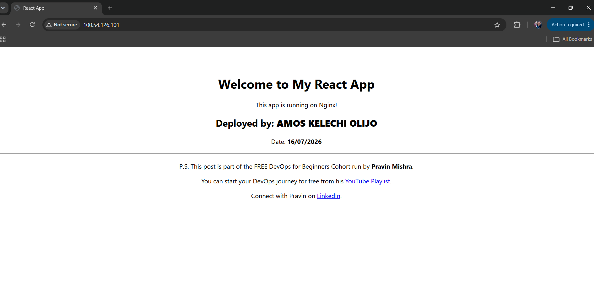
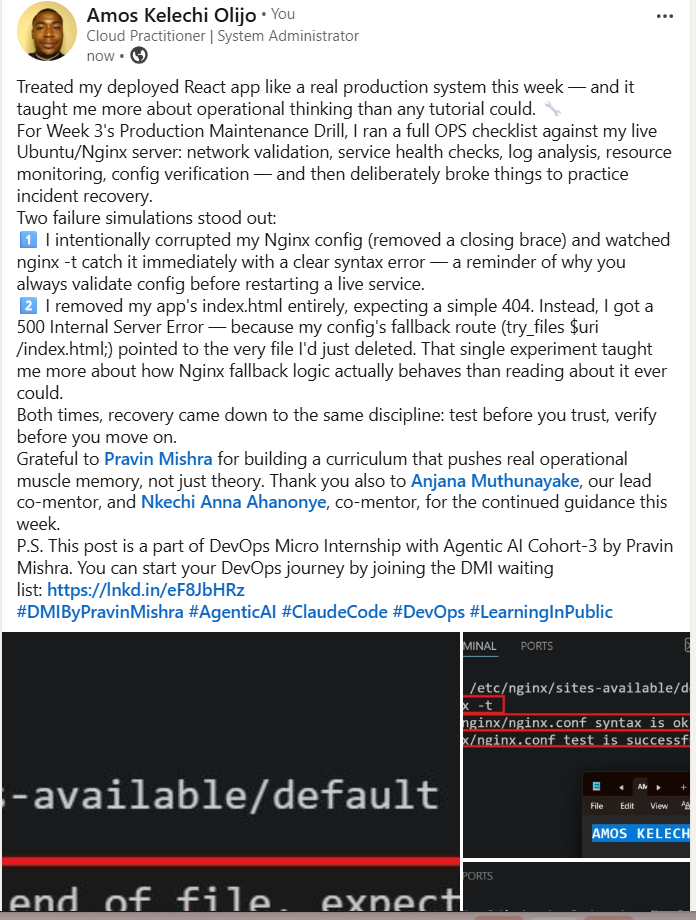

# Assignment 3 — Production Maintenance Drill (OPS Checklist)

Part of the DevOps Micro Internship (DMI) Cohort 3 with Agentic AI

---

## Purpose

In this assignment, you will treat your already deployed React application (on Ubuntu VM with Nginx) as a live production system. You will perform structured operational checks covering network validation, service health, log analysis, resource monitoring, configuration verification, and incident simulation with recovery — mirroring real on-call DevOps responsibilities.

---

# Task 1 — Server Access & Networking Validation

## Goal

Verify that the deployed React application is reachable from the browser and confirm basic network connectivity of the Ubuntu VM.

### Evidence

#### Screenshot 1 — Browser showing the React app with your Full Name visible on the UI

---

#### Screenshot 2 — Output of `ip a`

---

#### Screenshot 3 — Output of `sudo ss -tulpen`

---

#### Screenshot 4 — Output of `sudo ufw status`

---

### Notes

Answer the following in your own words:

**1. What proves Nginx is listening on 0.0.0.0:80?**

In the ss -tulpen output, a line showing LISTEN with local address 0.0.0.0:80 and process name nginx confirms it's bound to all network interfaces on port 80.

---

**2. What proves SSH is active on port 22?**

The ss -tulpen output shows a LISTEN entry on 0.0.0.0:22 (or *:22) tied to the sshd process.

---

**3. Did you find any unexpected open ports? Explain briefly.**

No unexpected ports were found. Only two ports are exposed externally (bound to 0.0.0.0): port 80 for Nginx (serving the React app) and port 22 for SSH (remote administration) — both of which are expected and required. The other listening services — chronyd (port 323), systemd-resolved (port 53), and systemd-network (port 68) — are all bound only to localhost (127.0.0.x) and are not reachable from outside the server, so they don't represent an exposure risk.

---

# Task 2 — Service Health & Systemd Validation (Nginx)

## Goal

Verify that Nginx is properly installed, running, enabled at boot, and safely configured.

### Evidence

#### Screenshot 1 — Output of `systemctl status nginx --no-pager`

---

#### Screenshot 2 — Output of `sudo nginx -t`

---

#### Screenshot 3 — Output of `sudo ss -lptn '( sport = :80 )'`

---

### Notes

Answer the following in your own words:

**1. What happens if Nginx fails to restart in production?**

The web server stops serving requests, so users get connection errors or timeouts instead of the site loading. Any dependent services or health checks would also start failing.

---

**2. What's your basic rollback plan?**

Keep a backup of the last known-good Nginx config before making changes. If a new config breaks things, restore the backup file and run sudo nginx -t to confirm it's valid, then sudo systemctl restart nginx.

---

# Task 3 — Logs & Request Trace

## Goal

Verify real traffic flow and analyze logs to understand system behavior and errors.

### Evidence

#### Screenshot 1 — Output of `sudo tail -n 30 /var/log/nginx/access.log`

---

#### Screenshot 2 — Output of `sudo tail -n 30 /var/log/nginx/error.log`

---

#### Screenshot 3 — Output of `sudo journalctl -u nginx --no-pager -n 50`

---

### Notes

Answer the following in your own words:

**1. Were there any errors in the logs?**

- If yes, mention 1–2 example error lines from the logs and explain what each one means in simple terms.
- If no, explain what it means if the error log is empty or shows no recent errors during your check.

No errors were found in /var/log/nginx/error.log — running sudo tail -n 30 on the file returned no output, meaning no error events have been recorded. An empty error log during a health check like this is a good sign; it typically means Nginx hasn't crashed, failed to process a request, or hit a configuration problem since the log was last written to.

---

**2. If there were no errors, what does that indicate about the system?**

It indicates the server is stable and functioning as expected — Nginx is correctly serving requests without misconfigurations, permission issues, or missing files that would normally trigger error entries. It's a sign of good system health at the time of the check.

---

**3. Based on the access logs, were your curl requests visible in the log entries? What does that prove about traffic flow?**

Yes, all three curl requests appear clearly in the access log, showing the timestamp, HTTP method (GET/HEAD), response status (200), and the "curl/8.5.0" user agent that identifies them as curl-originated requests. This proves that traffic reaching Nginx is being correctly captured and logged in real time — confirming the full request path from client to server to Nginx to log file is working as expected.

---

# Task 4 — System Resource Health Check (Capacity Red Flags)

## Goal

Assess server capacity and detect potential performance or failure risks.

### Evidence

#### Screenshot 1 — Output of `uptime`

---

#### Screenshot 2 — Output of `free -h`

---

#### Screenshot 3 — Output of `df -h`

---

#### Screenshot 4 — Output of `sudo du -sh /var/* | sort -h`

---

### Notes

Answer the following in your own words:

**1. Which resource looks most critical right now? (CPU/load, memory, or disk) Explain why.**

Memory is the resource to watch most closely, even though nothing is critical right now. The server only has 911Mi of total RAM (typical of a t3.micro Free Tier instance), and roughly 45% of it (411Mi) is already in use at idle, with 499Mi available. CPU load is currently at 0.00 across all intervals, meaning the server isn't under any processing strain, and disk usage is healthy at 44% with 3.8G free. If more services or traffic were added, memory would likely be the first resource to become a bottleneck given how little headroom this instance size provides.

---

**2. What happens if disk becomes 100% full in a production server?**

The server would be unable to write new files, including logs, temporary files, or new application deployments. Services like Nginx could fail to start, crash unexpectedly, or behave unpredictably when they can't write to disk. In severe cases, even basic system operations (like package updates or SSH session logging) could fail, making the server difficult to manage or recover without freeing up space first.

---

# Task 5 — Configuration & Deployment Verification

## Goal

Ensure the correct React build is deployed and Nginx is serving it properly.

### Evidence

#### Screenshot 1 — Output of `ls -lah /var/www/html | head -n 20`

---

#### Screenshot 2 — Output of `grep -R "Deployed by" -n /var/www/html 2>/dev/null | head`

---

#### Screenshot 3 — Output of `grep -n "try_files" /etc/nginx/sites-available/default`

---

### Notes

Answer the following in your own words:

**1. How do you confirm that the correct version of the application is deployed?**

By checking that the deployed files in /var/www/html match what was built — confirmed via ls -lah, which shows the expected files (index.html, asset-manifest.json, static/, etc.) with recent timestamps matching the deployment. Additionally, searching for the personalized "Deployed by" text with grep -R confirms the specific build containing my name and date is the one actually being served, not an older or generic version. Checking the Nginx config's try_files directive also confirms the routing is correctly set up to serve this React build.

---

# Task 6 — Nginx Configuration Failure Simulation

## Goal

Simulate a real-world Nginx misconfiguration and recover the service safely.

### Evidence

#### Screenshot 1 — Output of `sudo nginx -t` showing the syntax error (broken config)

---

#### Screenshot 2 — Output of `sudo nginx -t` showing syntax ok (fixed config)

---

#### Screenshot 3 — Output of `curl -I http://<public-ip>` confirming recovery (200 OK)

---

### Notes

Answer the following in your own words:

**1. What caused the configuration failure?**

I intentionally removed the closing curly brace } at the end of the server block in the Nginx config file, which broke the file's structure and caused Nginx to fail its syntax validation with an "unexpected end of file" error.

---

**2. How did you fix the issue?**

I reopened the config file with nano, added the missing closing brace back in its correct position, saved the file, and re-ran sudo nginx -t to confirm the syntax was valid before restarting the service.

---

**3. How can you avoid this kind of issue in real production systems?**

Always run nginx -t to validate syntax before restarting or reloading the service — never restart blindly after an edit. Use version control (e.g., Git) to track config changes so you can quickly diff or roll back, and consider automated config linting in CI/CD pipelines before deployment.

---

# Task 7 — Web Application Failure Simulation

## Goal

Simulate missing deployment content and recover the application safely.

### Evidence

#### Screenshot 1 — Output of `curl -I http://<public-ip>` showing failure (non-200 response)

---

#### Screenshot 2 — Output of `curl -I http://<public-ip>` confirming recovery (200 OK)

---

### Notes

Answer the following in your own words:

**1. What caused the application to break in this scenario?**

I renamed index.html in /var/www/html, removing the main entry point of the deployed React app. Because the Nginx config uses try_files $uri /index.html; as a fallback for all routes, and that fallback target no longer existed, Nginx couldn't resolve the request at all — resulting in a 500 Internal Server Error rather than a simple "file not found" response.

---

**2. How did you fix the issue and restore the application?**

 I restored the file by moving index.html.bak back to its original name and location in /var/www/html. Once the file existed again, curl -I confirmed the site returned 200 OK, verifying the app was serving correctly again.

---

**3. What steps would you take to prevent this kind of issue in real production systems?**

Avoid manual file operations directly on the production web root; deployments should go through an automated, tested pipeline instead. Keep backups of the current build before deploying a new one, and set up monitoring/alerting to catch non-200 responses quickly so issues are caught within seconds rather than being discovered by users.

---

# Task 8 — Security & Reliability Review

## Goal

Review and reflect on the security and reliability practices applied during this assignment.

### Security & Reliability Notes

Answer the following in your own words:

**1. Why is SSH key-based authentication more secure than sharing passwords?**

SSH keys use asymmetric cryptography — a private key that never leaves my machine and a public key installed on the server — making them far harder to brute-force or guess than a password. Passwords can be weak, reused across services, or intercepted, while a private key is a long, random cryptographic value that's practically infeasible to crack, and it's never transmitted over the network during authentication.

---

**2. Why should only required ports be open on a production server?**

Every open port is a potential entry point for an attacker. Keeping only the ports genuinely needed for the server's function (in this case, 22 for SSH and 80 for HTTP) minimizes the attack surface, reducing the chances that an unused or misconfigured service becomes a route for unauthorized access or exploitation.

---

**3. Why is it important for Nginx to be enabled on boot?**

If the server restarts — whether from a planned maintenance reboot, a crash, or an AWS infrastructure event — the web service needs to come back online automatically without manual intervention. Enabling Nginx on boot ensures minimal downtime and removes reliance on someone noticing and manually restarting the service.

---

**4. What are the risks of sharing secrets, keys, or credentials publicly?**

Exposed credentials can let anyone impersonate legitimate access to the system — reading, modifying, or deleting data, spinning up costly resources, or using the compromised access as a foothold to attack other connected systems. On cloud platforms specifically, leaked keys are often found and exploited within minutes by automated scanners, sometimes resulting in significant unexpected costs or data breaches.

---

**5. Why should cloud resources be stopped or terminated when they are no longer needed?**

Running resources continue to accrue cost even when idle, which can quickly exceed Free Tier limits or budget expectations. Beyond cost, unused running resources also remain a live attack surface — every additional running instance is one more thing that needs patching, monitoring, and securing. Terminating what's no longer needed reduces both unnecessary spend and unnecessary risk.

---

# LinkedIn Post (Required)

## Evidence

#### LinkedIn Post URL

Paste your LinkedIn post URL here:

`https://www.linkedin.com/posts/amosolijo_dmibypravinmishra-agenticai-claudecode-ugcPost-7483945087337582593-sp7t/?utm_source=share&utm_medium=member_desktop&rcm=ACoAACeeKxUBHCmo50w2w4CI7SAJd2ZqQPhPsCQ`

---

#### Screenshot — Published LinkedIn post

---

# Submission Instructions

- Add all required screenshots in your submission
- Full name must be visible in required screenshots
- Do not expose sensitive information (keys, passwords, account IDs)

---

# Completion Checklist

- [x] Task 1: Screenshots (browser, ip a, ss -tulpen, ufw status) + Notes answered
- [x] Task 2: Screenshots (nginx status, nginx -t, ss port 80) + Notes answered
- [x] Task 3: Screenshots (access log, error log, journalctl) + Notes answered
- [x] Task 4: Screenshots (uptime, free -h, df -h, du -sh) + Notes answered
- [x] Task 5: Screenshots (ls html, grep deployed by, grep try_files) + Notes answered
- [x] Task 6: Screenshots (nginx -t fail, nginx -t pass, curl recovery) + Notes answered
- [x] Task 7: Screenshots (curl failure, curl recovery) + Notes answered
- [x] Task 8: Security & Reliability Notes answered
- [x] LinkedIn post published and URL submitted
- [x] Full Name visible in all required screenshots
- [x] No sensitive data exposed

---

## 📌 About DMI & CloudAdvisory

DevOps Micro Internship (DMI) is a project-based DevOps program run by Pravin Mishra (The CloudAdvisory) focused on real-world execution, systems thinking, and career readiness.

It helps learners build strong DevOps foundations with hands-on experience.

---

## 📌 Resources

- 🌐 DMI Official Website: https://pravinmishra.com/dmi  
- 🎓 DevOps for Beginners (Udemy): https://www.udemy.com/course/devops-for-beginners-docker-k8s-cloud-cicd-4-projects/  
- 🎓 Agentic AI DevOps with Claude Code: https://www.udemy.com/course/ultimate-agentic-ai-devops-with-claude-code/  
- 🎓 DevOps with Claude Code: Terraform, EKS, ArgoCD & Helm: https://www.udemy.com/course/devops-with-claude-code-terraform-eks-argocd-helm/  
- ▶️ YouTube Playlist: https://www.youtube.com/playlist?list=PLFeSNDtI4Cho  
- 🔗 Pravin Mishra (LinkedIn): https://www.linkedin.com/in/pravin-mishra-aws-trainer/  
- 🏢 CloudAdvisory (LinkedIn): https://www.linkedin.com/company/thecloudadvisory/

---

*This submission is part of DevOps Micro Internship (DMI) Cohort 3 — Agentic AI Track.*