# Assignment 5 — Bash Script Automation Drill (OPS Checklist)

Part of the DevOps Micro Internship (DMI) Cohort 3 with Agentic AI

---

## Purpose

In this assignment, you will practice Bash scripting by building a series of small automation scripts covering environment setup, variables, arrays, loops, file conditionals, if-else logic, and functions. These scripts form the foundation of real-world Linux automation used in DevOps, cloud, and production support environments.

---

# Task 1 — Bash Environment & Workspace Setup

## Goal

Verify that Bash is available on your system and create a clean workspace for this assignment.

### Evidence

#### Screenshot 1 — Output of `echo $SHELL` and `bash --version`

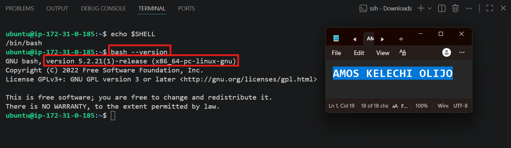

---

#### Screenshot 2 — Output of `pwd` and `ls -lah` showing the scripts directory

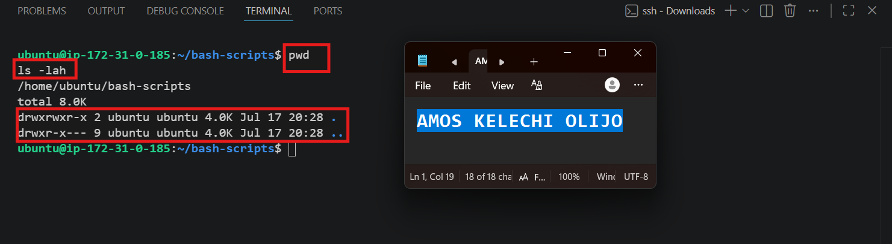

---

### Notes

**1. What is Bash?**

Bash (Bourne Again Shell) is a command-line interpreter and scripting language used on Linux/Unix systems to run commands, automate tasks, and manage the operating system.

---

**2. What is the difference between shell and Bash?**

"Shell" is the general term for any command-line interface that interprets user commands — there are several (sh, zsh, ksh, Bash). Bash is one specific, widely-used implementation of a shell, with its own syntax and features.

---

**3. Why is it important to confirm the Bash version before writing scripts?**

Different Bash versions support different features and syntax (e.g., associative arrays require Bash 4+). Confirming the version avoids writing scripts that fail or behave unexpectedly on the target system.

---

# Task 2 — Your First Bash Script

## Goal

Create your first Bash script, make it executable, and run it from the terminal.

### Evidence

#### Screenshot 1 — Content of `first-script.sh`

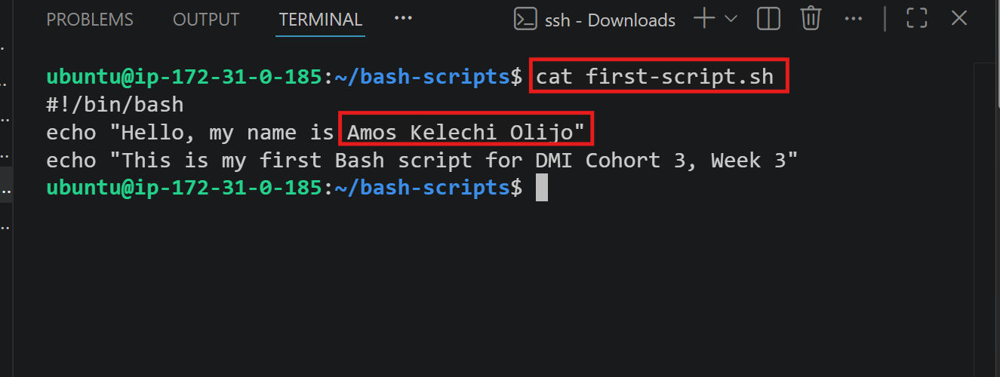

---

#### Screenshot 2 — Output of `./first-script.sh`

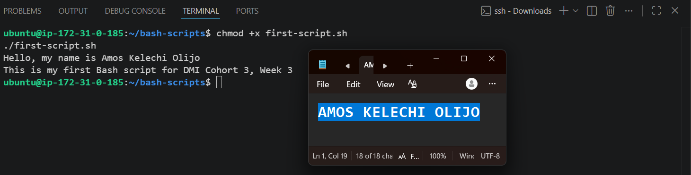

---

#### Screenshot 3 — Output of `ls -l first-script.sh` showing executable permission

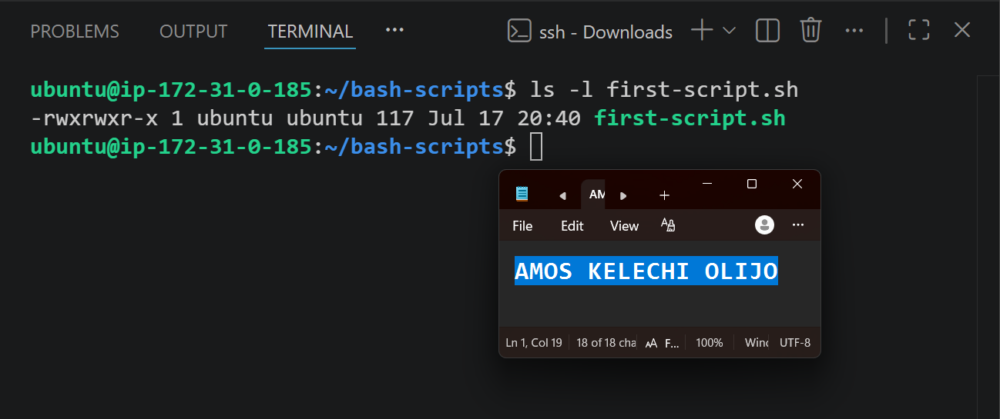

---

### Notes

**1. What is the purpose of `#!/bin/bash`?**

This is the "shebang" line — it tells the system which interpreter to use to run the script, ensuring it's executed with Bash specifically rather than a different shell.

---

**2. Why do we use `chmod +x` before running a script?**

By default, new files aren't executable for security reasons. `chmod +x` grants execute permission, allowing the script to be run directly as a program rather than just read as text.

---

**3. What is the difference between running a script using `./script.sh` and `bash script.sh`?**

`./script.sh` requires the file to have execute permission and uses the shebang line to determine the interpreter. `bash script.sh` explicitly invokes Bash to run the file's contents, regardless of whether it has execute permission or a shebang line.

---

# Task 3 — Variables: User Information Script

## Goal

Use variables to store and display user-related information.

### Evidence

#### Screenshot 1 — Content of `user-info.sh`

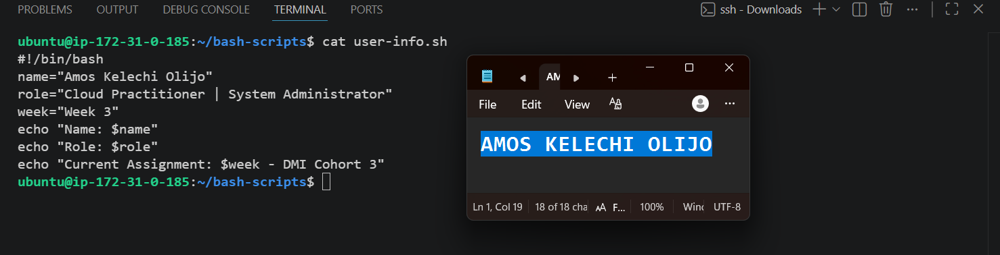

---

#### Screenshot 2 — Output of `./user-info.sh`

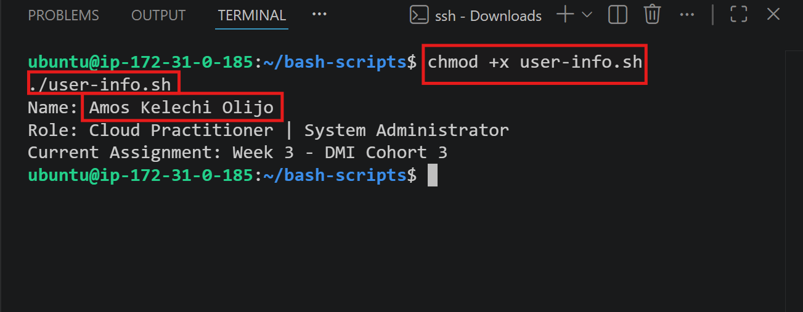

---

### Notes

**1. What is a variable in Bash?**

A named storage location that holds a value (text, number, etc.) which can be referenced and reused throughout a script.

---

**2. Why should we avoid spaces around the `=` sign when creating variables?**

Bash interprets `name = value` (with spaces) as a command called `name` with arguments, not as an assignment. Bash requires `name=value` with no spaces for correct variable assignment.

---

**3. How do you access the value stored inside a Bash variable?**

By prefixing the variable name with a dollar sign, e.g. `$name` or `${name}`.

---

# Task 4 — Arrays & Loops: Tools Checklist Script

## Goal

Use arrays and loops to print a checklist of tools used in Bash scripting.

### Evidence

#### Screenshot 1 — Content of `tools-checklist.sh`

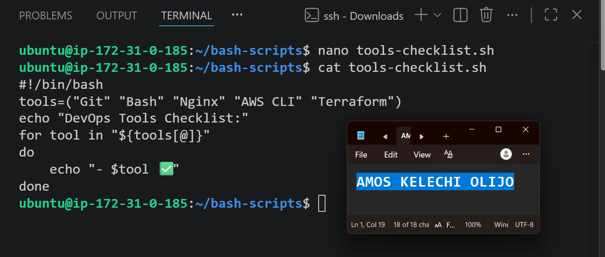

---

#### Screenshot 2 — Output of `./tools-checklist.sh`

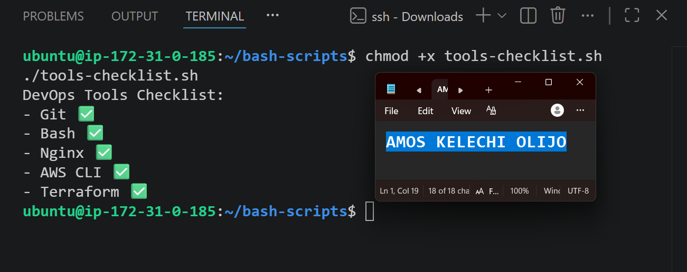

---

### Notes

**1. What is an array in Bash?**

A variable that can hold multiple values (a list) instead of just one, indexed by position.

---

**2. Why are arrays useful in scripts?**

They let you store and manage related data together, making it easy to loop through, add to, or reference multiple items without creating separate variables for each one.

---

**3. What does `"${tools[@]}"` mean?**

It expands to all elements of the `tools` array, treating each item as a separate, properly quoted word — important when array values might contain spaces.

---

**4. What is the purpose of the `for` loop in this script?**

It iterates through each item in the `tools` array one at a time, running the `echo` command for every tool in the list without needing to write repetitive code.

---

# Task 5 — Loops: Number Counter Script

## Goal

Use loops to repeat a task multiple times.

### Evidence

#### Screenshot 1 — Content of `counter.sh`

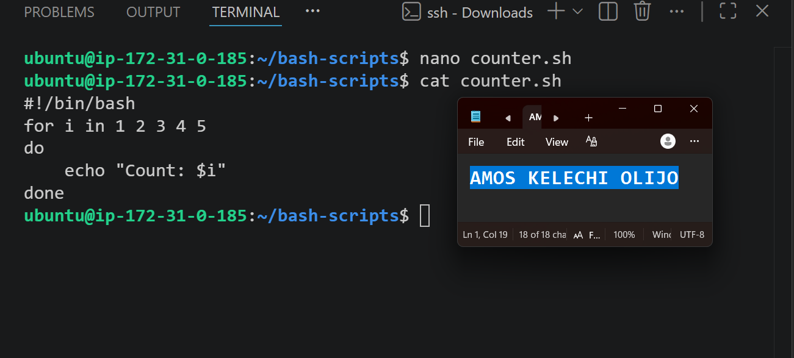

---

#### Screenshot 2 — Output of `./counter.sh`

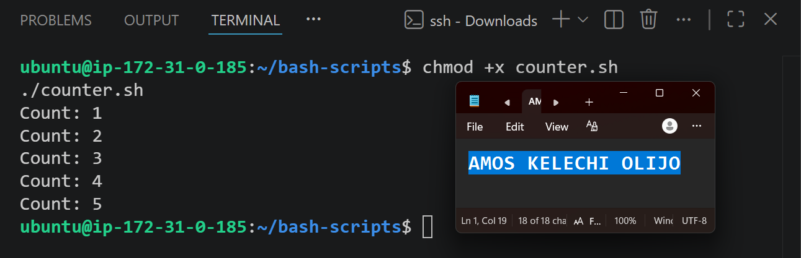

---

### Notes

**1. What is a loop?**

A control structure that repeats a block of code multiple times until a condition is met or a defined set of values is exhausted.

---

**2. Why do we use loops in Bash scripting?**

They eliminate repetitive code, making scripts shorter, more maintainable, and able to handle variable amounts of data or iterations dynamically.

---

**3. How many times did the loop run in your script?**

5 times (once for each number 1 through 5).

---

**4. What would you change if you wanted the loop to run 10 times?**

Either list numbers 1 through 10 explicitly (`for i in 1 2 3 4 5 6 7 8 9 10`) or use a range: `for i in {1..10}`.

---

# Task 6 — Files & Conditionals: File Validation Script

## Goal

Use file checks and conditionals to verify whether files and directories exist.

### Evidence

#### Screenshot 1 — Output of `ls -lah ../test-folder`

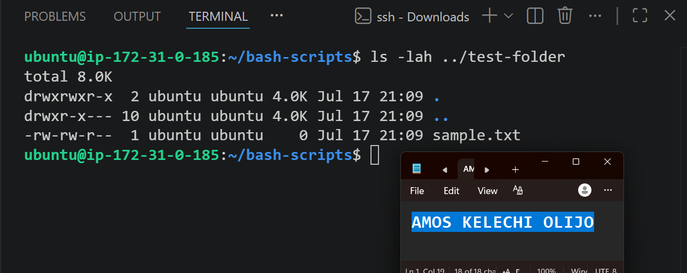

---

#### Screenshot 2 — Content of `file-check.sh`

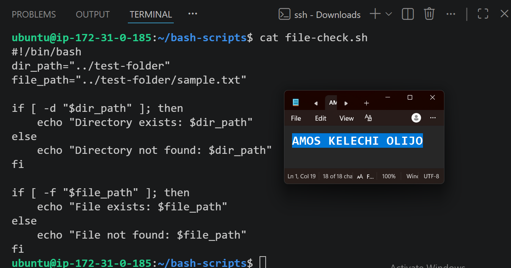

---

#### Screenshot 3 — Output of `./file-check.sh`

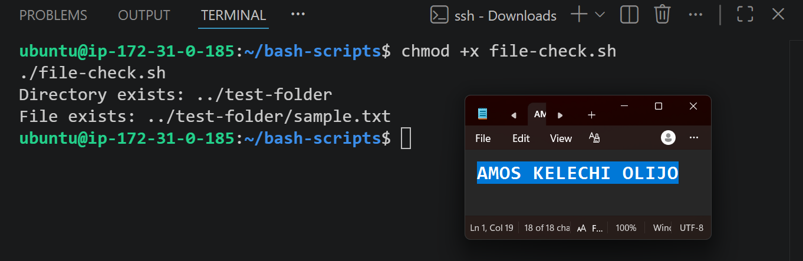

---

### Notes

**1. What does `-d` check in Bash?**

Whether the given path exists and is a directory.

---

**2. What does `-f` check in Bash?**

Whether the given path exists and is a regular file.

---

**3. Why should file and directory paths be stored in variables?**

It makes the script easier to maintain and update — if the path changes, you only edit it in one place rather than every line that references it. It also reduces the risk of typos across multiple uses.

---

**4. What happens if the file does not exist?**

The `-f` condition evaluates to false, so the script's `else` branch runs, printing a "not found" message instead of attempting an operation on a missing file (which would otherwise cause an error).

---

# Task 7 — Conditionals: Pass or Retry Script

## Goal

Use if-else conditionals to make decisions based on a variable value.

### Evidence

#### Screenshot 1 — Content of `score-check.sh` with `score=85`

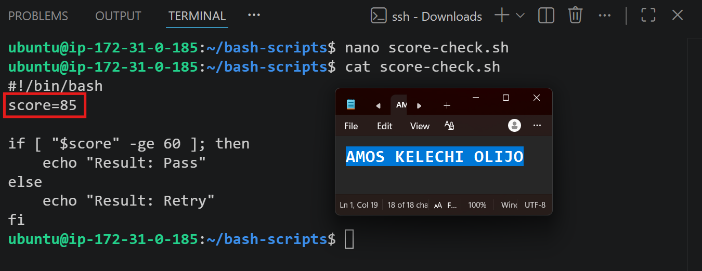

---

#### Screenshot 2 — Output showing `Result: Pass`

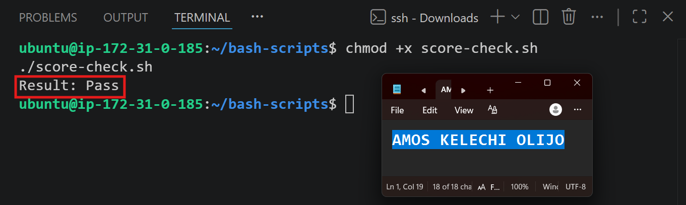

---

#### Screenshot 3 — Content of `score-check.sh` with `score=55`

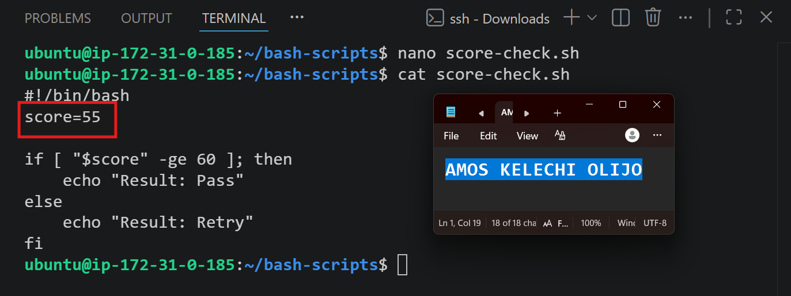

---

#### Screenshot 4 — Output showing `Result: Retry`

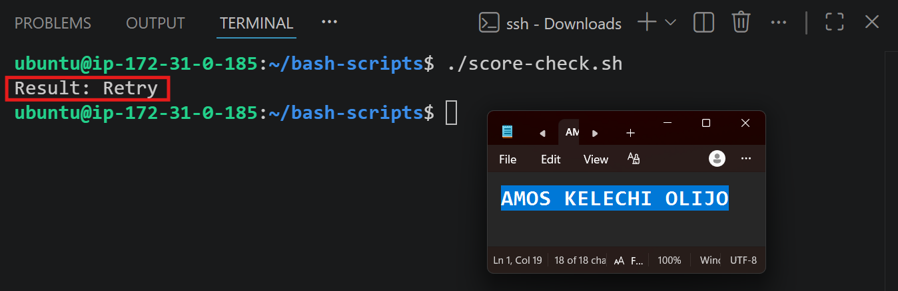

---

### Notes

**1. What is the purpose of if-else in Bash?**

It allows a script to make decisions and execute different code paths depending on whether a condition is true or false.

---

**2. What does `-ge` mean?**

"Greater than or equal to" — used in numeric comparisons in Bash conditionals.

---

**3. Why should conditions be tested with different values?**

Testing multiple values (like 85 and 55) confirms the script's logic correctly handles both branches of the condition, not just the "happy path" — this catches bugs that a single test case might miss.

---

**4. How can conditionals help in automation scripts?**

They let scripts respond intelligently to different situations automatically — e.g., retrying a failed step, skipping unnecessary work, or triggering alerts — without needing a human to make each decision manually.

---

# Task 8 — Functions: Final Bash Automation Script

## Goal

Create a final Bash script using functions to organize reusable code.

### Evidence

#### Screenshot 1 — Content of `final-automation.sh`

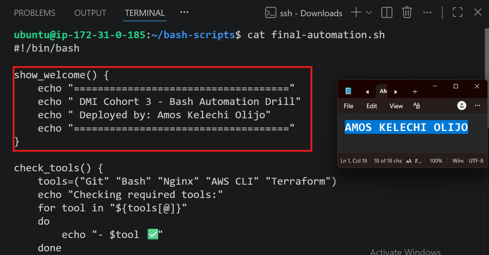

---

#### Screenshot 2 — Output of `./final-automation.sh`

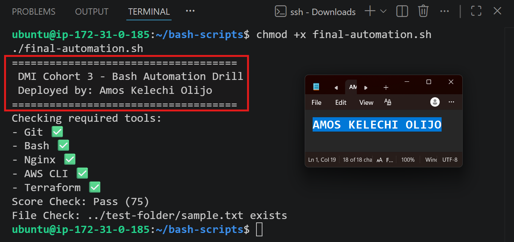

---

#### Screenshot 3 — Output of `ls -lah` showing all created scripts

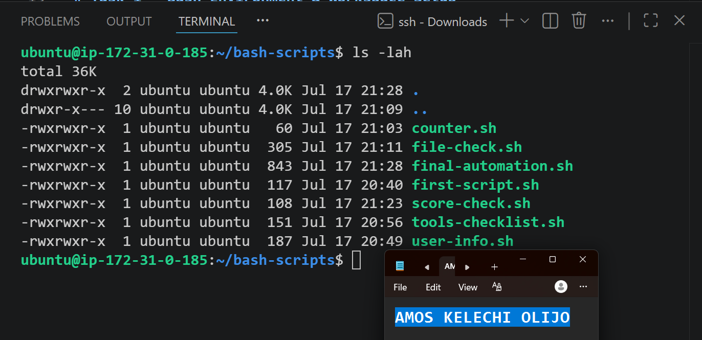

---

### Notes

**1. What is a function in Bash?**

A named block of reusable code that performs a specific task, which can be called multiple times within a script without rewriting the logic each time.

---

**2. Why are functions useful in scripts?**

They make scripts more organized, readable, and maintainable by breaking complex logic into smaller, focused, reusable pieces — reducing duplication and making debugging easier.

---

**3. Which functions did you create in this script?**

`show_welcome`, `check_tools`, `check_score`, and `check_files`.

---

**4. How does this final script combine variables, arrays, loops, conditionals, files, and functions?**

It uses variables (`score`, `file_path`), an array with a loop (`tools`), conditionals (if-else for score and file checks), and functions to organize each capability into a separate, callable block — then runs them together in sequence to produce a single cohesive automation report.

---

# LinkedIn Post (Required)

## Evidence

#### LinkedIn Post URL

Paste your LinkedIn post URL here:

`https://www.linkedin.com/posts/amosolijo_dmibypravinmishra-agenticai-claudecode-ugcPost-7484000363172306945-nU7p/?utm_source=share&utm_medium=member_desktop&rcm=ACoAACeeKxUBHCmo50w2w4CI7SAJd2ZqQPhPsCQ`

---

#### Screenshot — Published LinkedIn post

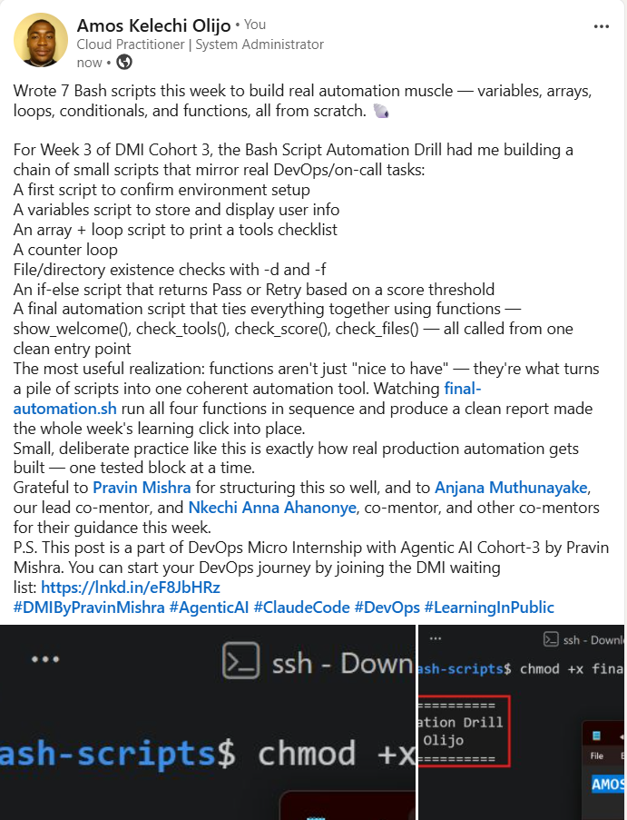

---

# Submission Instructions

- Add all required screenshots in your submission
- Full name must be visible in required screenshots
- All script files must be created and run successfully
- Required notes must be answered clearly for every task
- Do not expose sensitive information (keys, passwords, credentials)

---

# Completion Checklist

- [x] Task 1: Environment setup verified, workspace created (Screenshots 1–2, Notes answered)
- [x] Task 2: First script created, executed, permissions verified (Screenshots 1–3, Notes answered)
- [x] Task 3: Variables script created and run (Screenshots 1–2, Notes answered)
- [x] Task 4: Arrays and loops script created and run (Screenshots 1–2, Notes answered)
- [x] Task 5: Counter loop script created and run (Screenshots 1–2, Notes answered)
- [x] Task 6: File validation script created and run (Screenshots 1–3, Notes answered)
- [x] Task 7: Pass/Retry conditional script tested with both values (Screenshots 1–4, Notes answered)
- [x] Task 8: Final automation script created and run (Screenshots 1–3, Notes answered)
- [x] All scripts run without errors
- [x] Full Name visible in all required screenshots
- [x] LinkedIn post published and URL submitted
- [x] No sensitive data exposed

---

## 📌 About DMI & CloudAdvisory

DevOps Micro Internship (DMI) is a project-based DevOps program run by Pravin Mishra (The CloudAdvisory) focused on real-world execution, systems thinking, and career readiness.

It helps learners build strong DevOps foundations with hands-on experience.

---

## 📌 Resources

- 🌐 DMI Official Website: https://pravinmishra.com/dmi  
- 🎓 DevOps for Beginners (Udemy): https://www.udemy.com/course/devops-for-beginners-docker-k8s-cloud-cicd-4-projects/  
- 🎓 Agentic AI DevOps with Claude Code: https://www.udemy.com/course/ultimate-agentic-ai-devops-with-claude-code/  
- 🎓 DevOps with Claude Code: Terraform, EKS, ArgoCD & Helm: https://www.udemy.com/course/devops-with-claude-code-terraform-eks-argocd-helm/  
- ▶️ YouTube Playlist: https://www.youtube.com/playlist?list=PLFeSNDtI4Cho  
- 🔗 Pravin Mishra (LinkedIn): https://www.linkedin.com/in/pravin-mishra-aws-trainer/  
- 🏢 CloudAdvisory (LinkedIn): https://www.linkedin.com/company/thecloudadvisory/

---

*This submission is part of DevOps Micro Internship (DMI) Cohort 3 — Agentic AI Track.*