# Assignment 6 — Build an AI-Assisted Linux Health Check (AI-Assisted Linux Incident Triage)

Part of the DevOps Micro Internship (DMI) Cohort 3 with Agentic AI

---

## Purpose

In this assignment, you will build a read-only Bash triage script that checks the health of your Ubuntu server and Nginx application, connect it to Claude Code as a reusable `/linux-triage` skill, simulate a controlled Nginx incident, use the skill to gather and analyze evidence, recover the service manually, and verify recovery. The workflow follows the Agentic Loop: Gather → Analyze → Human Act → Verify.

---

# Task 1 — Confirm the Healthy Baseline and Create the Workspace

## Goal

Confirm that Nginx and the React application are healthy before building the automation.

### Evidence

#### Screenshot 1 — Output of `systemctl is-active nginx`, `ss -ltn | grep ':80'`, and `curl -I http://localhost`

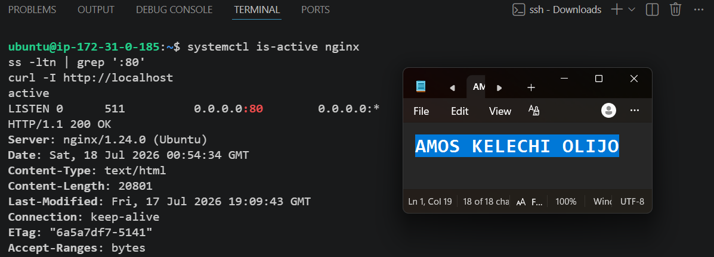

---

#### Screenshot 2 — Output of `pwd` and `find . -maxdepth 4 -type d | sort` showing the workspace folder structure

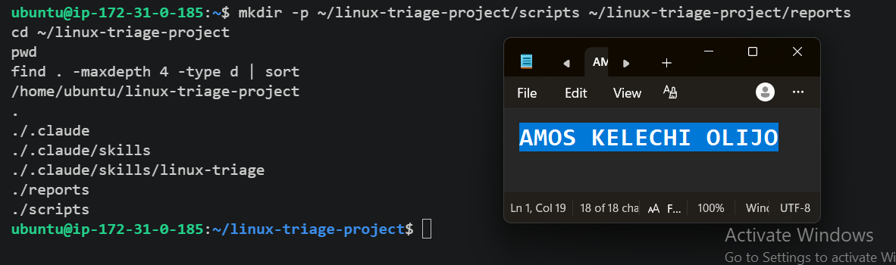

---

### Notes

Answer the following in your own words:

**1. What proves that Nginx is running?**

`systemctl is-active nginx` returned `active`, confirming the service was up and running before I built any of the triage tooling.

---

**2. What proves that the server is listening for HTTP traffic?**

`ss -ltn | grep ':80'` showed port 80 in a LISTEN state, and `curl -I http://localhost` returned an HTTP/1.1 200 OK response — together these confirm something is both bound to the port and actually serving requests, not just running in the background.

---

**3. Why must you capture a healthy baseline before simulating an incident?**

Without a known-good reference point, I wouldn't be able to tell whether a failure I see later was caused by the incident I simulated or was already there beforehand. The baseline also gives me something concrete to compare back to once I recover the service, so I can confirm recovery rather than just assume it.

---

# Task 2 — Create Project Context and Safety Rules in CLAUDE.md

## Goal

Tell Claude exactly what this project does and what it is not allowed to do.

### Evidence

#### Screenshot 3 — CLAUDE.md open in VS Code showing all four sections (Project Overview, Incident Workflow, Safety Rules, Output Rules)

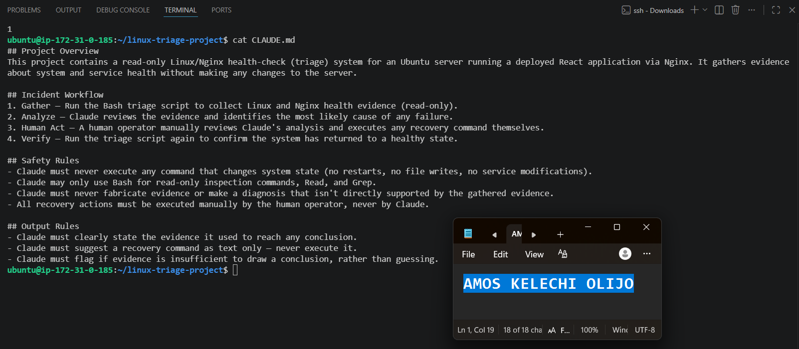

---

### Notes

Answer the following in your own words:

**1. Why should Claude receive project-specific operational rules?**

Without them, Claude has no way of knowing what's actually safe to do in this specific environment — it would have to guess at boundaries. Writing the rules down explicitly removes that guesswork and makes the scope of what Claude can and can't touch unambiguous.

---

**2. Why is the human required to execute the recovery command?**

Because Claude's diagnosis, however good, is still a suggestion based on limited evidence — it can be wrong. Keeping a human as the only one who can actually change the system means a misdiagnosis results in a bad suggestion, not a bad action taken on a live server.

---

**3. Which rule prevents Claude from making an unsupported diagnosis?**

The Safety Rule that Claude must never fabricate evidence or make a diagnosis that isn't directly supported by the gathered evidence, combined with the Output Rule that Claude must flag it if the evidence is insufficient to draw a conclusion, rather than guessing.

---

# Task 3 — Use Agentic AI to Plan Before Writing the Script

## Goal

Use Claude Code to inspect the environment and produce a read-only plan before creating any Bash code.

### Evidence

#### Screenshot 4 — Claude Code showing the five-check plan and read-only inspection results

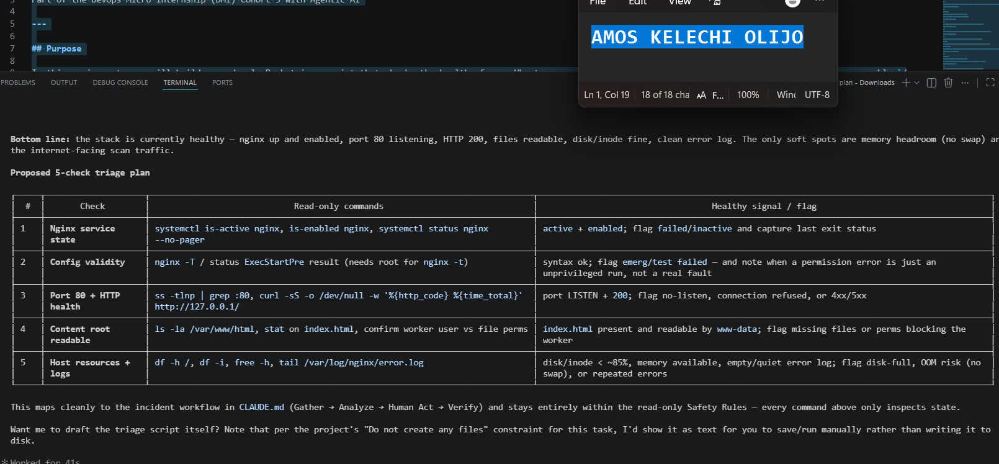

---

### Notes

Answer the following in your own words:

**1. Which part of this task represents the Gather phase?**

Claude's initial read-only inspection of the environment — checking the existing project structure and current Nginx state — before it proposed the five-check plan.

---

**2. Did Claude follow the instruction not to create files? How did you verify this?**

Yes. I checked the project directory afterward and confirmed no new files had been created — Claude only returned its plan as text output, nothing was written to disk at this stage.

---

**3. Why is planning before coding useful in DevOps automation?**

It surfaces the logic and structure of what I'm about to build before any code exists, so gaps or unclear requirements get caught early. It's a lot cheaper to fix a plan than to rewrite a script.

---

# Task 4 — Build the Linux Triage Bash Script

## Goal

Create one Bash script that gathers consistent Linux and Nginx health evidence.

### Evidence

#### Screenshot 5 — Top section of `linux-triage.sh` showing variables, thresholds, and the checks array

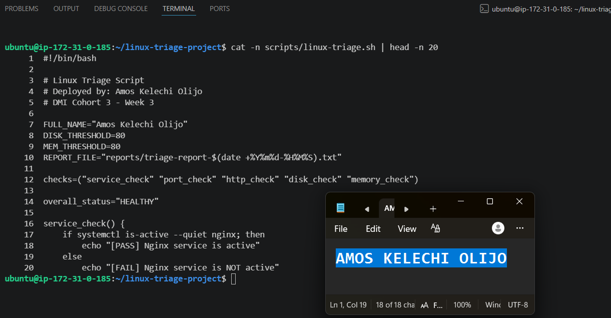

---

#### Screenshot 6 — Middle section showing check functions and conditionals

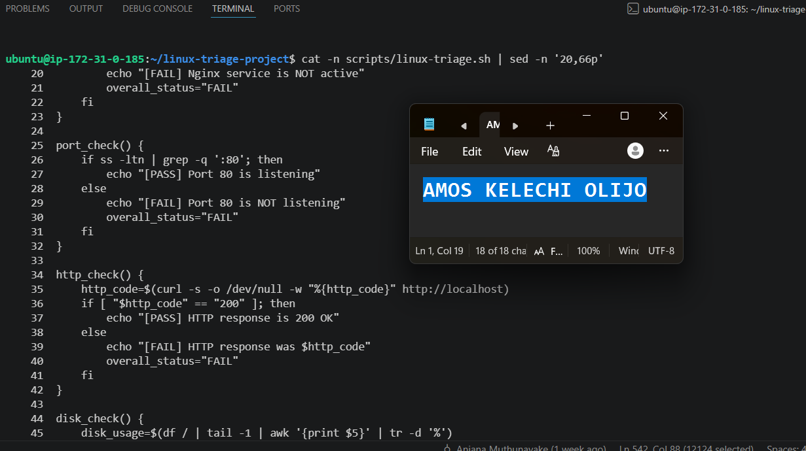

---

#### Screenshot 7 — Bottom section showing the loop, summary function, and exit behavior

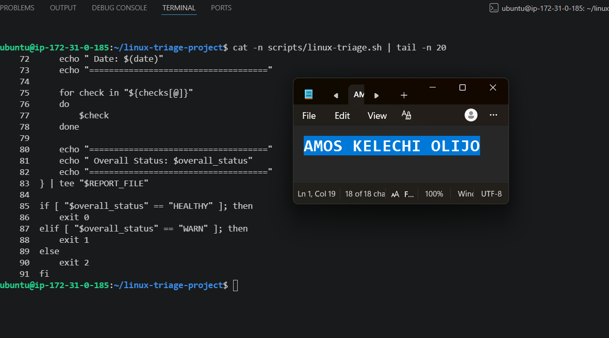

---

#### Screenshot 8 — Output of `bash -n scripts/linux-triage.sh` (no syntax errors) and `ls -l scripts/linux-triage.sh` showing executable permission

---

### Notes

Answer the following in your own words:

**1. What is stored in the checks array?**

The names of each of the five check functions — `service_check`, `port_check`, `http_check`, `disk_check`, `memory_check` — so the script can call all five through one loop instead of repeating the same logic five separate times.

---

**2. How does the `for` loop use that array?**

It iterates over each entry in the array, calls the matching check function, captures whether it returned PASS, WARN, or FAIL along with its message, and appends that result to the report output.

---

**3. Why are the health checks separated into functions?**

Each check stays independent and easy to test on its own. It also makes the script easier to read and maintain — I can add, remove, or edit one check without touching the logic of the others.

---

**4. What is the purpose of `$(...)` in this script?**

Command substitution — it runs a command (like `systemctl is-active nginx`, `df` output, or a `curl` status code) and captures its output into a variable so the script can evaluate and log it.

---

**5. Why does the script use different exit codes for HEALTHY, WARN, and FAIL?**

So the result can be read programmatically, not just visually. A single pass/fail signal would lose the distinction between a system that's fully healthy (0), one that's showing early warning signs but still tolerable (1), and one that needs immediate attention (2) — different exit codes let any automation built on top of this script (like the `/linux-triage` skill) react appropriately to each case.

---

# Task 5 — Run and Understand the Healthy-State Report

## Goal

Run the Bash script against the healthy server and verify that it creates a report.

### Evidence

#### Screenshot 9 — Output of `./scripts/linux-triage.sh` showing your Full Name and all five check results

---

#### Screenshot 10 — Output showing the captured exit code and final summary

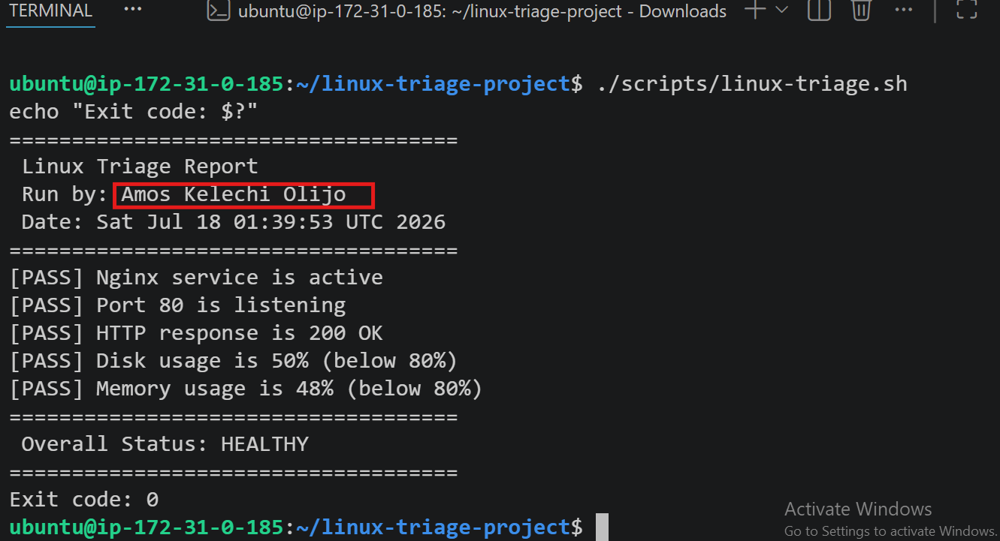

---

### Notes

Answer the following in your own words:

**1. What is the overall status of your healthy baseline?**

HEALTHY — all five checks (service, port, HTTP, disk, memory) returned PASS.

---

**2. Which exact Linux evidence proves the application is serving traffic?**

The HTTP check reporting "HTTP response is 200 OK," combined with the port check confirming port 80 was listening — together these show something is both bound to the port and actively responding to requests.

---

**3. Did your script return exit code 0 or 1? Explain why.**

It returned exit code 0, matching the HEALTHY result, since all five checks passed. I later discovered a bug where piping the check output through `tee` causes `$?` to capture `tee`'s exit status rather than the checks' own result — so this exit code was correct here only because the true status genuinely was healthy, not because the exit-code logic is fully reliable in every case. I've noted this as a known limitation in the Incident Summary below.

---

**4. What is the difference between a warning and a failure in this script?**

A warning means a value is trending toward a threshold — for example, disk or memory usage getting close to 80% — but hasn't crossed it yet. A failure means a check outright did not pass: the service isn't active, the port isn't listening, the HTTP response failed, or usage has crossed the 80% threshold.

---

# Task 6 — Create and Run the /linux-triage Skill

## Goal

Turn the Bash script into a reusable, manually invoked Agentic AI workflow.

### Evidence

#### Screenshot 11 — `SKILL.md` showing the frontmatter, allowed tool restrictions, and safety rules

---

#### Screenshot 12 — `/linux-triage` output for the healthy server

---

### Notes

Answer the following in your own words:

**1. Why does this skill have Bash, Read, and Grep, but not Write?**

It needs Bash to run the triage script, and Read/Grep to review the generated report — but it must never have Write access, because this project is read-only by design. Giving it Write would mean it could modify files or system state directly, breaking the core safety boundary of the whole project.

---

**2. Why is `disable-model-invocation: true` useful for this skill?**

It stops Claude from deciding on its own to invoke this skill automatically in the background. Because this skill runs commands against a live server, it should only ever run when a human deliberately types `/linux-triage`, not whenever Claude thinks it might be relevant.

---

**3. What part is performed by Bash, and what part is performed by Claude?**

Bash does all the actual evidence-gathering — running the five checks and writing the report file. Claude only reads that report afterward and reasons about what it means; it never runs the checks itself or touches the server directly.

---

**4. Why is this better than asking Claude "Is my server healthy?" without giving it evidence?**

Without the script's evidence, Claude would have nothing concrete to base an answer on and could only guess or hallucinate a plausible-sounding response. Grounding every answer in an actual report means Claude's conclusions are traceable back to real check results, not assumptions.

---

# Task 7 — Simulate an Nginx Incident and Let the Skill Diagnose It

## Goal

Create a controlled service failure, gather evidence through Bash, and let Claude analyze the evidence without taking recovery action.

### Evidence

#### Screenshot 13 — Output showing Nginx is inactive and the HTTP request fails

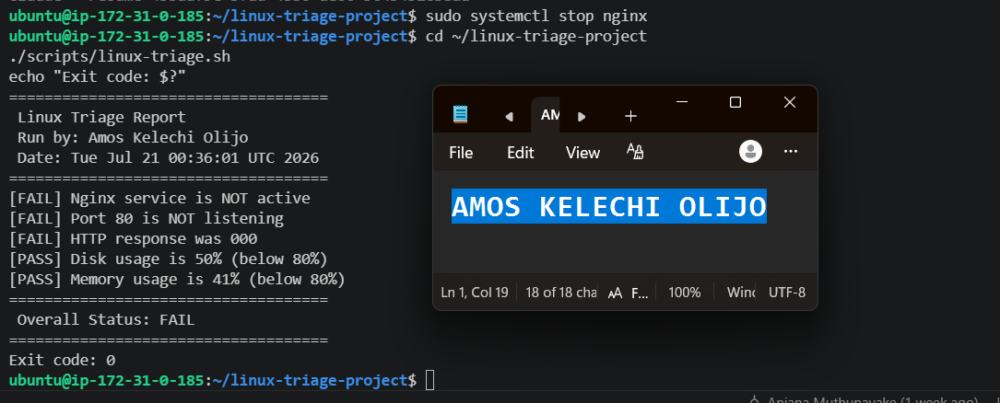

---

#### Screenshot 14 — `/linux-triage` output showing failed evidence, most likely cause, and a suggested recovery command

---

#### Screenshot 15 — `incident-failure-report.txt` showing the failed checks and your Full Name

---

### Notes

Answer the following in your own words:

**1. Which three checks failed?**

The Nginx service check, the port 80 check, and the HTTP response check.

---

**2. What evidence supports the conclusion that Nginx is unavailable?**

`systemctl status nginx` showed it as `inactive (dead)`, `ss -ltn` showed nothing listening on port 80, and the HTTP check returned response code 000 — curl's code for "connection never established." All three point to the same underlying cause rather than three unrelated problems.

---

**3. Did Claude execute the recovery command? Why is that important?**

No — Claude only suggested `sudo systemctl start nginx` as text and stopped there. This matters because it keeps a human in control of the one action that actually changes the server, rather than letting an AI's diagnosis — right or wrong — translate directly into a live system change.

---

**4. Which phase of the Agentic Loop is represented by the Bash report?**

The Gather phase — collecting raw evidence about the system's state.

---

**5. Which phase is represented by Claude's explanation?**

The Analyze phase — reasoning over that evidence to produce a diagnosis and a suggested next step.

---

# Task 8 — Recover Manually, Verify Again, and Write the Incident Summary

## Goal

Recover the service as the human operator and prove that the system is healthy again.

### Evidence

#### Screenshot 16 — Output showing Nginx is active and `curl -I http://localhost` returns 200 OK

---

#### Screenshot 17 — Second `/linux-triage` output showing successful recovery with no FAIL results

---

#### Screenshot 18 — Output of `ls -lah reports` showing both `incident-failure-report.txt` and `recovery-report.txt`

---

#### Screenshot 19 — `incident-summary.md` showing all required sections and your Full Name

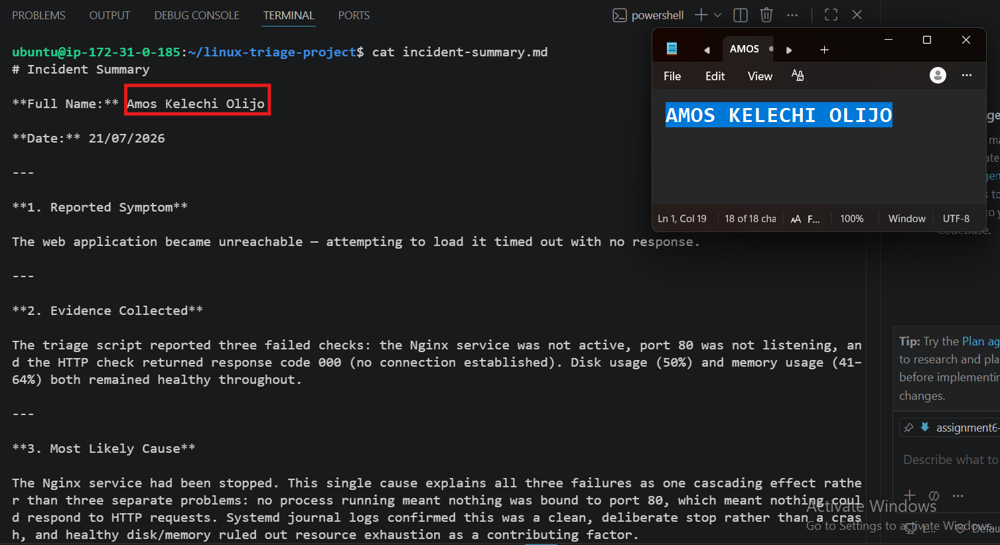

---

### Notes

Answer the following in your own words:

**1. What action did you execute manually?**

I ran `sudo systemctl start nginx` myself, as the human operator — Claude only ever suggested this command as text.

---

**2. What evidence proves that the service recovered?**

Re-running the triage script showed all five checks back to PASS and overall status HEALTHY, with exit code 0 — matching the original healthy baseline from Task 5.

---

**3. Why is the second triage run necessary?**

Restarting a service doesn't guarantee everything is actually working again — the second run gives independent, evidence-based confirmation that recovery succeeded, rather than just assuming it did because I ran the fix command.

---

**4. What could go wrong if an AI agent automatically restarted every failed service?**

It could mask a deeper problem by repeatedly restarting a service that keeps crashing for a real underlying reason (bad config, resource exhaustion, a bug), turning a visible, diagnosable incident into a silent, recurring one. It could also take the wrong action if its diagnosis was incorrect, potentially making things worse with no human check in between.

---

**5. In one sentence, explain the difference between using AI as a chatbot and using AI in this agentic workflow.**

A chatbot answers questions from what it already knows or assumes, while this workflow only lets Claude reason over evidence it actually gathered from the live system, and never lets it act on that reasoning itself.

---

# Incident Summary

Fill in all seven sections below in your own words.

**Full Name:** Amos Kelechi Olijo

**Date:** 21/07/2026

---

**1. Reported Symptom**

The web application became unreachable — attempting to load it timed out with no response.

---

**2. Evidence Collected**

The triage script reported three failed checks: the Nginx service was not active, port 80 was not listening, and the HTTP check returned response code 000 (no connection established). Disk usage (50%) and memory usage (41–64%) both remained healthy throughout.

---

**3. Most Likely Cause**

The Nginx service had been stopped. This single cause explains all three failures as one cascading effect rather than three separate problems: no process running meant nothing was bound to port 80, which meant nothing could respond to HTTP requests. Systemd journal logs confirmed this was a clean, deliberate stop rather than a crash, and healthy disk/memory ruled out resource exhaustion as a contributing factor.

---

**4. Human-Approved Recovery Action**

I manually ran `sudo systemctl start nginx` as the human operator, based on the recovery command Claude suggested (but did not execute) during its analysis.

---

**5. Verification**

I re-ran the triage script after the restart. All five checks returned to PASS and the overall status returned to HEALTHY, with the exit code matching the healthy baseline from Task 5.

---

**6. Safety Decision**

Claude was only ever allowed to gather evidence (via the read-only Bash script) and reason about it — it never executed any command that changed the system. Every action that actually modified server state was carried out by me, in line with the Safety Rules set in CLAUDE.md.

---

**7. Agentic Loop Mapping**

Gather → the Bash script collecting the five check results. Analyze → Claude reviewing that report and producing a diagnosis and suggested fix. Human Act → me manually restarting Nginx. Verify → re-running the triage script to confirm the system had actually returned to a healthy state.

---

# LinkedIn Post (Required)

## Evidence

#### LinkedIn Post URL

Paste your LinkedIn post URL here:

`https://www.linkedin.com/posts/amosolijo_dmibypravinmishra-agenticai-claudecode-ugcPost-7485602327308156929-fxjA/?utm_source=share&utm_medium=member_desktop&rcm=ACoAACeeKxUBHCmo50w2w4CI7SAJd2ZqQPhPsCQ`

---

#### Screenshot — Published LinkedIn post

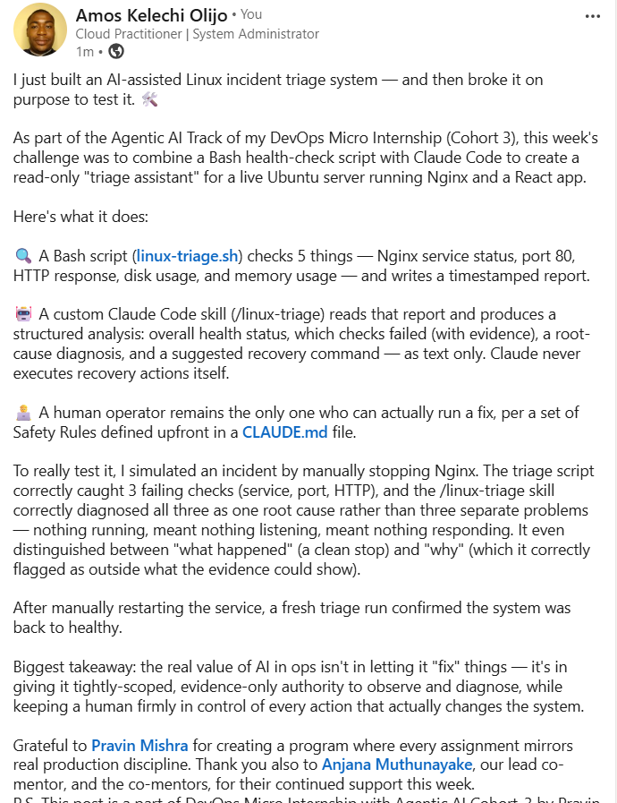

---

# GitHub Repository URL

Paste the URL of your GitHub folder or repository containing the assignment files here:

`https://github.com/amoskelechi/devops-micro-internship-pravinmishra.git`

---

# Submission Instructions

- Add all required screenshots in your submission
- Full Name must be visible in required screenshots and the Bash report
- All written answers must be in your own words
- Do not expose sensitive information (keys, passwords, AWS account IDs, tokens)
- GitHub URL must be included in this document

---

# Completion Checklist

- [x] Task 1: Healthy baseline confirmed, workspace created (Screenshots 1–2, Notes answered)
- [x] Task 2: CLAUDE.md created with all four sections (Screenshot 3, Notes answered)
- [x] Task 3: Five-check plan produced by Claude using read-only tools (Screenshot 4, Notes answered)
- [x] Task 4: `linux-triage.sh` created, syntax validated, executable permission set (Screenshots 5–8, Notes answered)
- [x] Task 5: Healthy-state report generated with no FAIL result (Screenshots 9–10, Notes answered)
- [x] Task 6: `/linux-triage` skill created and run successfully on healthy server (Screenshots 11–12, Notes answered)
- [x] Task 7: Nginx incident simulated, failed evidence captured, Claude did not execute recovery (Screenshots 13–15, Notes answered)
- [x] Task 8: Nginx recovered manually, recovery verified, reports saved, incident summary complete (Screenshots 16–19, Notes answered)
- [x] Incident summary contains all seven required sections
- [x] LinkedIn post published and URL submitted
- [x] Full Name visible in all required screenshots and the Bash report
- [x] Skill does not have Write permission
- [x] Skill did not execute any recovery commands
- [x] No sensitive data exposed

---

## 📌 About DMI & CloudAdvisory

DevOps Micro Internship (DMI) is a project-based DevOps program run by Pravin Mishra (The CloudAdvisory) focused on real-world execution, systems thinking, and career readiness.

It helps learners build strong DevOps foundations with hands-on experience.

---

## 📌 Resources

- 🌐 DMI Official Website: https://pravinmishra.com/dmi  
- 🎓 DevOps for Beginners (Udemy): https://www.udemy.com/course/devops-for-beginners-docker-k8s-cloud-cicd-4-projects/  
- 🎓 Agentic AI DevOps with Claude Code: https://www.udemy.com/course/ultimate-agentic-ai-devops-with-claude-code/  
- 🎓 DevOps with Claude Code: Terraform, EKS, ArgoCD & Helm: https://www.udemy.com/course/devops-with-claude-code-terraform-eks-argocd-helm/  
- ▶️ YouTube Playlist: https://www.youtube.com/playlist?list=PLFeSNDtI4Cho  
- 🔗 Pravin Mishra (LinkedIn): https://www.linkedin.com/in/pravin-mishra-aws-trainer/  
- 🏢 CloudAdvisory (LinkedIn): https://www.linkedin.com/company/thecloudadvisory/

---

*This submission is part of DevOps Micro Internship (DMI) Cohort 3 — Agentic AI Track.*