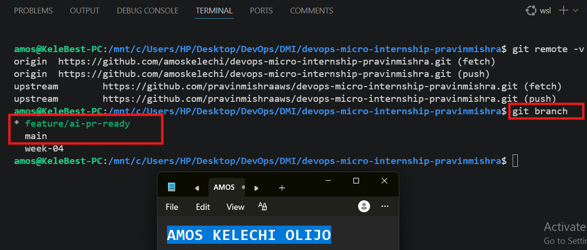
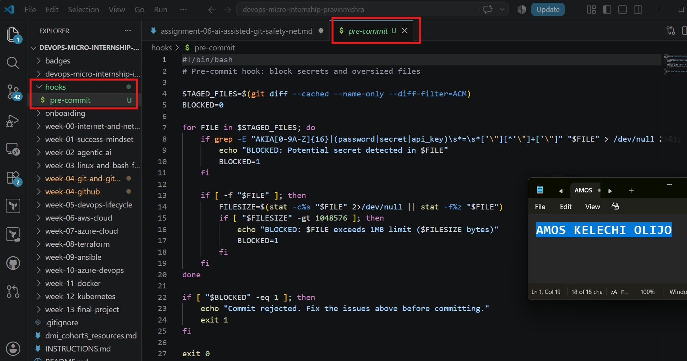
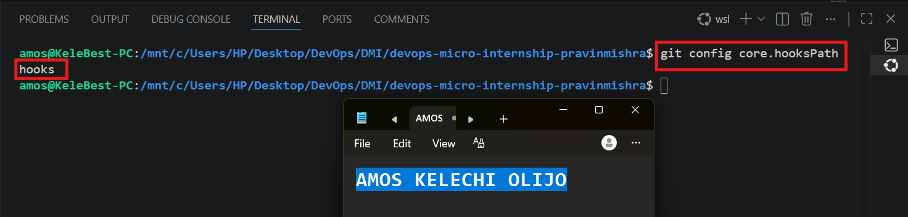
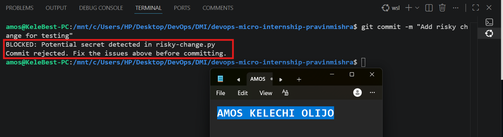
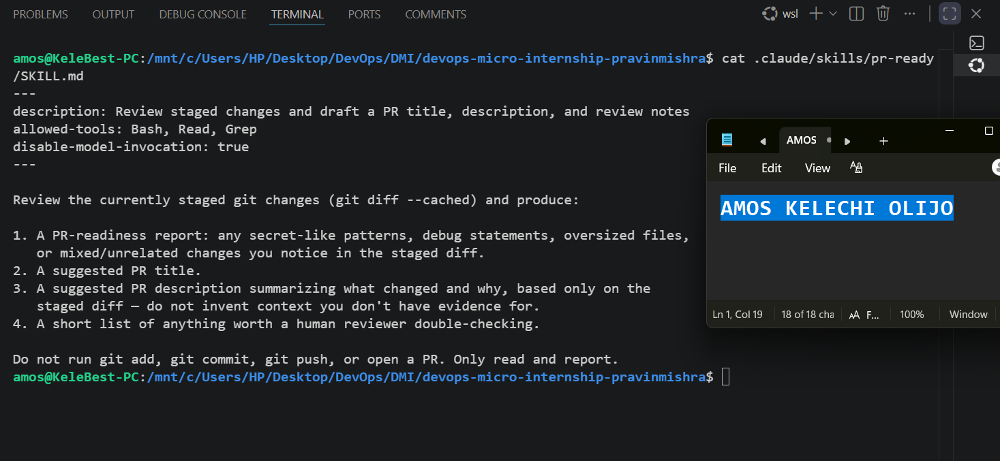
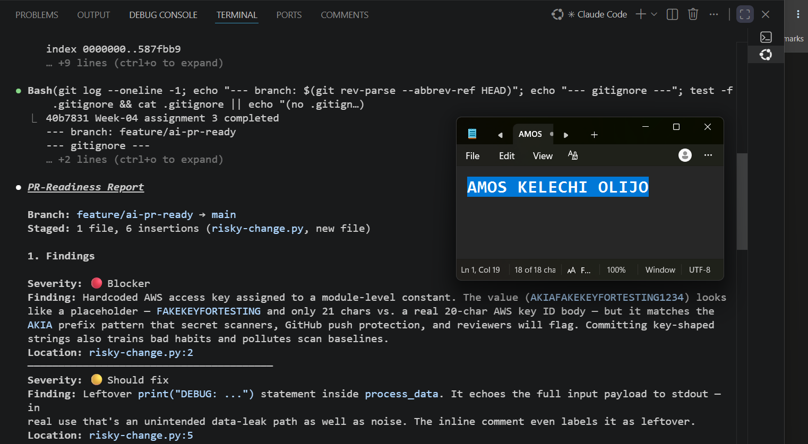
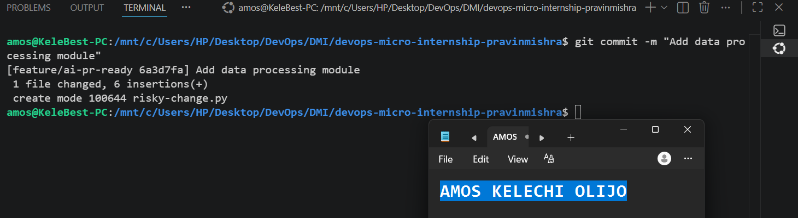
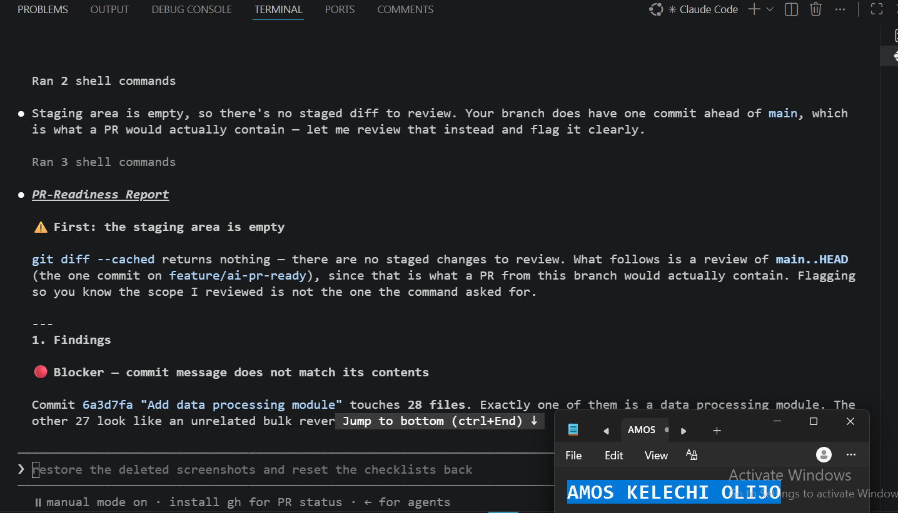
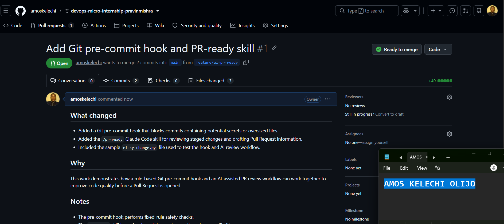

# Assignment 6 — Building an AI-Assisted Git Safety Net (PR Ready Check)

Part of the DevOps Micro Internship (DMI) Cohort 3 with Agentic AI

---

## Purpose

In Week 2 you built Claude Code hooks that block a dangerous action *before* it happens (`PreToolUse`), and a restricted skill that could look but not touch (`allowed-tools` without `Write`). In this assignment you will discover that Git has the exact same idea, decades older: a **pre-commit hook** that blocks a commit before it's created.

You will build both halves of a real "PR Ready" workflow:

1. A **Git hook that follows fixed rules** — scans staged changes for hardcoded secrets and oversized files and refuses the commit. No AI involved, no guessing, just a rule that gives the same answer every time.
2. A **restricted Claude Code skill** (`/pr-ready`) that reads your staged diff and drafts a Pull Request title, description, and a short list of things worth a second look — the kind of judgment a fixed rule can't make (mixed changes, missing context, unclear intent). The skill never commits, pushes, or opens the PR. You do that yourself, using its draft as a starting point.

This mirrors the Agentic Loop from Week 3's Linux triage assignment: **Gather → Analyze → Human Act → Verify**. The hook and the skill both gather and analyze; only you act.

---

# Task 0 — Confirm Your Fork and Create a Feature Branch

## Goal

Confirm you are working in your own fork, then create a dedicated branch for this assignment.

### Evidence

#### Screenshot 1 — Output of git remote -v and git branch showing the new branch

---

### Notes

**1. Why create a dedicated branch instead of doing this work on main?**

A dedicated branch keeps this experimental, practice-only work isolated from your main branch's stable history. If something goes wrong (a bad hook, an accidental real secret), it's contained to a disposable branch rather than polluting the branch other work builds on.

---

# Task 1 — Stage a Change With Realistic Risk

## Goal

On your own fork of this repository (the one you've been submitting your DMI work in since onboarding), create a new branch and stage a change that a real reviewer should catch: a hardcoded-looking secret and a leftover debug statement.

### Evidence

#### Screenshot 1 — Output of  `git status` showing the staged file on feature/ai-pr-ready

---

### Notes

**1. Why does this assignment use an obviously fake key instead of a real one?**

A fake, clearly-invalid key (AKIAFAKEKEYFORTESTING1234) lets the hook and skill be tested against realistic-looking secret patterns without ever creating a real credential-leak risk if the repo, screenshots, or commit history are ever exposed publicly.

---

# Task 2 — Write a Real Git Pre-Commit Hook

## Goal

Create a tracked, shareable pre-commit hook that blocks  commit containing secret-like patterns or files over 1MB.

### Evidence

#### Screenshot 2 — `hooks/pre-commit` open in VS Code showing the full script

---

#### Screenshot 3 — Output of `git config core.hooksPath` confirming it points to `hooks`

---

### Notes

**1. Why is `hooks/pre-commit` tracked in the repo instead of living only in `.git/hooks/`?**

.git/hooks/ is local-only and never gets pushed or shared, so every teammate would have to recreate the hook by hand. Tracking it in hooks/ and pointing core.hooksPath there means the hook travels with the repo and everyone who clones it gets the same protection automatically.

---

**2. Compare this to `PreToolUse` from Week 2 Assignment 6. What does each one intercept, and what do they have in common?**

PreToolUse intercepts Claude before it runs a tool call; this hook intercepts Git before it creates a commit. Both sit at the exact moment right before an action becomes permanent, both apply a fixed rule with no judgment involved, and both can block the action outright rather than just warning about it afterward.

---

# Task 3 — Prove the Hook Blocks the Risky Commit

## Goal

Attempt to commit the staged file from Task 1 and show the hook rejecting it.

### Evidence

#### Screenshot 4 — Terminal showing `git commit` rejected with the hook's "BLOCKED" message naming the exact file

---

### Notes

**1. Which line in `hooks/pre-commit` matched your fake key, and why did it match?**

The regular expression AKIA[0-9A-Z]{16} matched the intentionally created fake AWS access key because it followed the same format as an AWS access key. After demonstrating that the hook worked, I removed the fake key as required before making the final commit.

---

**2. Could this hook have caught a poorly-named variable that stores a secret without the `AKIA` prefix? What does that tell you about the limits of a fixed rule like this?**

No — the hook only recognizes specific known patterns (the AKIA prefix, or password=/secret=/api_key=). A secret stored under an unrelated variable name with no recognizable pattern would slip through completely, showing that fixed rules only catch what they were explicitly written to look for.

---

# Task 4 — Build the `/pr-ready` Skill

## Goal

Create a manually invoked Claude Code skill that reads your staged changes and produces a PR-readiness report and a draft PR description — without writing, committing, or pushing anything itself.

### Evidence

#### Screenshot 5 — `SKILL.md` frontmatter showing `allowed-tools: Bash, Read, Grep` (no `Write`) and `disable-model-invocation: true`

---

#### Screenshot 6 — `/pr-ready` output while the risky file is still staged, showing it flagged the secret and/or debug statement

---

### Notes

**1. Why does `/pr-ready` have `Bash` and `Read` but not `Write`?**

It needs Bash to run git diff --cached and Read to review file contents, but must never have Write, since this skill's entire job is to analyze and report — never to modify, stage, or commit anything itself.

---

**2. The pre-commit hook and `/pr-ready` both looked at the same staged diff. Did they flag the same things? What did one catch that the other didn't?**

The hook caught the hardcoded key because it matches a fixed pattern, but a rule like that can't reliably recognize a debug print statement as a problem — that requires understanding intent. The skill caught both: the secret pattern and the debug statement, because it can reason about what the code is actually doing rather than just pattern-matching.//

---

# Task 5 — Fix the Issues and Re-Verify

## Goal

Remove the secret and debug statement, then prove both gates now pass clean.

### Evidence

#### Screenshot 7 — `git commit` succeeding after the fix (no BLOCKED message)

---

#### Screenshot 8 — Second `/pr-ready` run showing a clean risk report and a drafted PR title + description

---

### Notes

**1. What exactly did you change to satisfy the pre-commit hook?**

What exactly did you change? — Removed the hardcoded AWS_ACCESS_KEY line and the leftover print("DEBUG: ...") statement, leaving only the actual process_data logic — nothing else about the function's behavior changed.

---

# Task 6 — Push and Open a Pull Request Using the AI Draft

## Goal

Push your branch and open a real Pull Request, using `/pr-ready`'s drafted title and description as your starting point — read it critically and edit before you use it.

**Important:** Open this Pull Request with base repository set to **your own fork** — not the shared upstream `pravinmishraaws/devops-micro-internship-pravinmishra` repository. This assignment's hook and skill files are your own practice work, not a change meant for the shared class repo.

### Evidence

#### Screenshot 9 — Your Pull Request showing the base repository is your own fork, plus the title and description, with the `/pr-ready` draft visible for comparison (paste it in the PR conversation or your notes below)

---

#### PR Link

`https://github.com/amoskelechi/devops-micro-internship-pravinmishra/pull/1`

---

### Notes

**1. What, if anything, did you edit in the AI's drafted PR description before using it? Why?**

I edited the AI-generated PR description to accurately reflect the final contents of my Pull Request. The original draft focused mainly on the risky-change.py file, but my final PR also included the Git pre-commit hook and the /pr-ready skill. I updated the description so it correctly summarized all the changes being submitted.

---

**2. If you had blindly copy-pasted the AI's draft without reading it, what could go wrong?**

The PR description could have been inaccurate or incomplete. Reviewers might receive the wrong impression about what was actually changed, which could lead to confusion during code review. AI-generated content should always be reviewed and corrected before use.

---

**3. Why does this PR need to target your own fork instead of the shared upstream repository?**

This assignment is intended as personal practice, so the changes belong in my own fork. Opening the Pull Request against my fork prevents practice files and experimental work from being submitted to the shared upstream repository used by everyone in the internship.

---

# Task 7 — Map the Workflow to the Agentic Loop

## Goal

Explain this assignment's workflow using the same Gather → Analyze → Human Act → Verify structure from Week 3.

### Notes

**1. Which step(s) represent Gather?**

The Gather step happens when the Git pre-commit hook scans the staged files and when the /pr-ready skill reads the staged Git diff. Both collect the information needed before any decision is made.

---

**2. Which step(s) represent Analyze?**

The Analyze step is when the pre-commit hook checks the staged files against its fixed rules, such as detecting secret-like patterns and oversized files. At the same time, the /pr-ready skill analyzes the staged changes to identify potential issues, generate a PR title and description, and point out anything that deserves a second review.

---

**3. Which step is Human Act, and why must a human — not Claude — run `git commit`, `git push`, and open the PR?**

The Human Act step is when I reviewed the results, fixed the issues, committed my changes, pushed the branch, and created the Pull Request. A human must perform these actions because they change the repository and require personal judgment and responsibility. The AI can provide recommendations, but it should not make those decisions automatically.

---

**4. Which step is Verify?**

Verify happens after fixing the identified issues. I re-ran the pre-commit hook and the /pr-ready skill to confirm that the problems had been resolved before committing, pushing, and opening the Pull Request.

---

**5. In one or two sentences: why do you need *both* the fixed-rule pre-commit hook and the AI skill? Isn't one enough?**

The pre-commit hook reliably catches problems that can be detected with fixed rules, such as secret patterns and oversized files. The AI skill provides context-aware review, helping identify issues that fixed rules cannot, so using both creates a more effective and reliable review process.

---

# Task 8 — LinkedIn Post

## Goal

Publish a LinkedIn post summarizing what you built and what you learned about combining fixed-rule safety checks with AI-assisted review.

### Evidence

#### LinkedIn Post URL

`https://www.linkedin.com/posts/amosolijo_devops-git-github-ugcPost-7490992410584387584-Tydi/?utm_source=share&utm_medium=member_desktop&rcm=ACoAACeeKxUBHCmo50w2w4CI7SAJd2ZqQPhPsCQ`

---

## Key Learnings

Add 3-5 bullet points on what you learned this week.

- Learned how to create a Git pre-commit hook to automatically detect potential secrets and oversized files before commits are made.
- Gained hands-on experience creating a custom Claude Code skill (`/pr-ready`) to review staged changes and generate a Pull Request title, description, and review notes.
- Understood the importance of reviewing AI-generated suggestions critically instead of accepting them without verification.
- Learned how to create a Pull Request against my own forked repository and document changes using clear, professional PR descriptions.
- Improved my Git workflow by combining automation with human review to produce cleaner and more secure code contributions.

---

# Submission Instructions

- Ensure `hooks/pre-commit` and `.claude/skills/pr-ready/SKILL.md` are committed to your GitHub repository
- Add all required screenshots to your submission
- All written answers must be in your own words
- Do not use a real secret or credential anywhere in your submission — the fake key in Task 1 is intentional and must stay clearly fake
- Open your Pull Request against your own fork, not the shared upstream repository
- Push your final changes to your forked repository
- Include your PR link and LinkedIn post URL

---

## GitHub Repository URL

Paste your forked repository URL here:

`https://github.com/amoskelechi/devops-micro-internship-pravinmishra`

---

# Completion Checklist

- [x] Branch `feature/ai-pr-ready` created with a staged file containing a fake secret and a debug statement
- [x] `hooks/pre-commit` created and tracked in the repo (not only in `.git/hooks/`)
- [x] `core.hooksPath` configured to point at `hooks/`
- [x] Pre-commit hook shown blocking the risky commit
- [x] `.claude/skills/pr-ready/SKILL.md` created with correct `allowed-tools` (no `Write`) and `disable-model-invocation: true`
- [x] `/pr-ready` run against the risky diff and shown flagging issues
- [x] Risky file fixed; `git commit` succeeds cleanly
- [x] `/pr-ready` re-run showing a clean report and drafted PR title/description
- [x] Pull Request opened using the AI draft as a starting point, with your own fork as the base repository (not upstream), PR link included
- [x] Agentic Loop mapping (Task 7) completed in your own words
- [x] LinkedIn post published and URL submitted
- [x] All required screenshots added
- [x] GitHub repository URL provided

---

## 📌 About DMI & CloudAdvisory

DevOps Micro Internship (DMI) is a project-based DevOps program run by Pravin Mishra (The CloudAdvisory) focused on real-world execution, systems thinking, and career readiness.

It helps learners build strong DevOps foundations with hands-on experience.

---

## 📌 Resources

- 🌐 DMI Official Website: https://pravinmishra.com/dmi  
- 🎓 DevOps for Beginners (Udemy): https://www.udemy.com/course/devops-for-beginners-docker-k8s-cloud-cicd-4-projects/  
- 🎓 Agentic AI DevOps with Claude Code: https://www.udemy.com/course/ultimate-agentic-ai-devops-with-claude-code/  
- 🎓 DevOps with Claude Code: Terraform, EKS, ArgoCD & Helm: https://www.udemy.com/course/devops-with-claude-code-terraform-eks-argocd-helm/  
- ▶️ YouTube Playlist: https://www.youtube.com/playlist?list=PLFeSNDtI4Cho  
- 🔗 Pravin Mishra (LinkedIn): https://www.linkedin.com/in/pravin-mishra-aws-trainer/  
- 🏢 CloudAdvisory (LinkedIn): https://www.linkedin.com/company/thecloudadvisory/

---

*This submission is part of DevOps Micro Internship (DMI) Cohort 3 — Agentic AI Track.*
