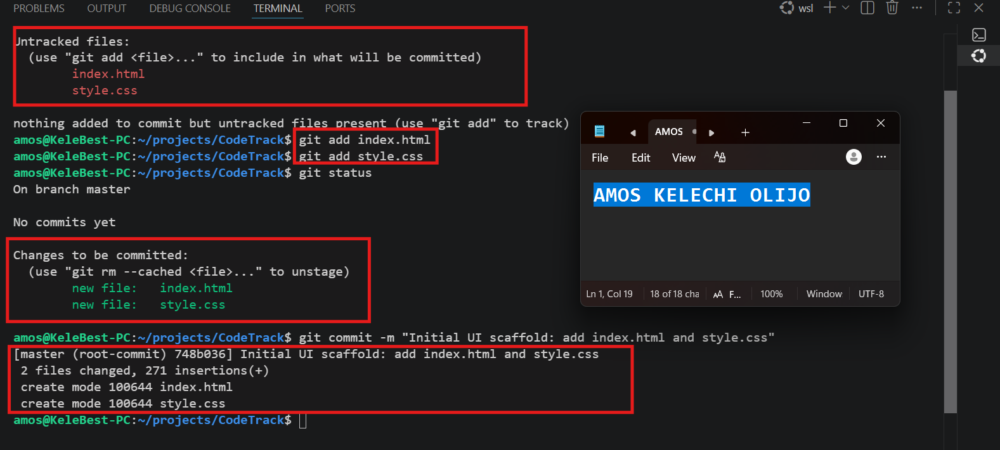

# Week 04 — GitHub & Version Control

Part of the DevOps Micro Internship (DMI) Cohort 3 with Agentic AI

---

## Purpose

This week you learned Git and GitHub — the foundation of every DevOps workflow. Complete all tasks below and update your progress in the main [README.md](../README.md).

---

# Task 1 — Create Your GitHub Account & Profile

## Goal

Set up your GitHub profile professionally.

### Evidence

#### What I did

I reviewed and updated my GitHub profile to present a professional online presence. I ensured my profile includes a professional photo, a concise bio highlighting my DevOps interests, my location, a LinkedIn profile link, and pinned repositories that showcase my projects and learning progress.

#### Screenshot 1 — Your GitHub profile


---

# Task 2 — Initialize a Repository

## Goal

Create this repository, clone it locally, and make your first commit.

### Commands I used

```bash
git init
git add .
git commit -m "initial commit"
```

### Evidence

#### Screenshot 2 — Output of your first commit



---

# Task 3 — Branching & Pull Request

## Goal

Create a branch, make a change, and open a Pull Request.

### Evidence

#### What I did

Add your answer here...

#### PR Link

Add your PR URL here...

#### Screenshot 3 — Your Pull Request

Add your screenshot here.

---

# Task 4 — LinkedIn Post

## Goal

Publish a LinkedIn post summarizing what you learned this week.

### Evidence

#### LinkedIn Post URL

Add your LinkedIn post URL here...

---

## Key Learnings

Add 3-5 bullet points on what you learned this week.

-
-
-

---

*Part of the [DevOps Micro Internship with Agentic AI](https://www.linkedin.com/in/pravin-mishra-aws-trainer/) by Pravin Mishra — Join: https://discord.pravinmishra.com/*
