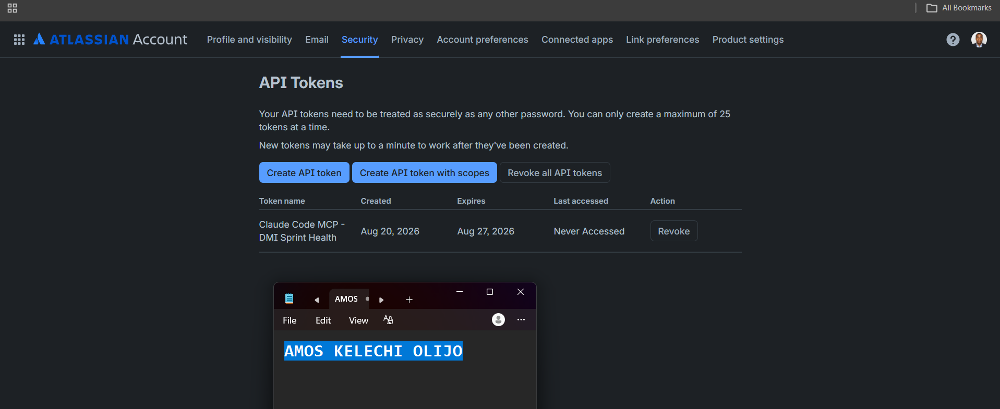
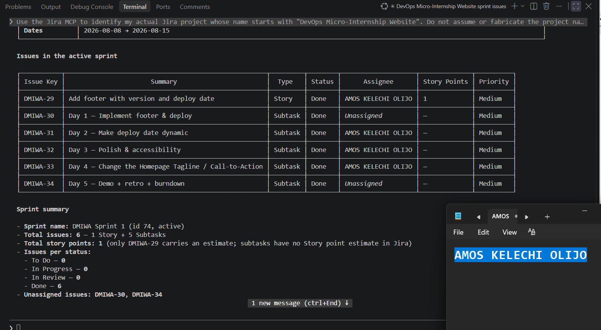
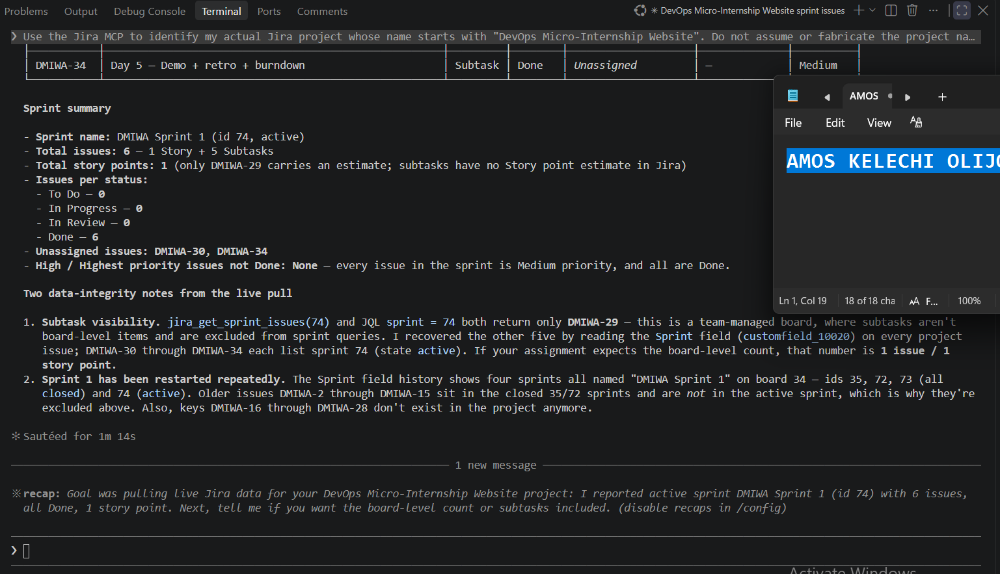

# Assignment 5 — AI-Assisted Sprint Health Report via Jira MCP

Part of the DevOps Micro Internship (DMI) Cohort 3 with Agentic AI

---

## Purpose

In this assignment, you will connect Claude Code to your Jira board through an MCP server, the same way you connected it to GitHub in Week 2, and build a read-only `/sprint-health` skill. The skill reads your current sprint through Jira's API and reports sprint velocity, stories at risk of missing the sprint, and items missing an estimate — but it must never create, edit, comment on, or transition a single ticket itself. You will prove that boundary holds by making a real change on the board yourself and confirming the skill only ever reports, never acts.

---

# Task 1 — Create a Jira API Token

## Goal

Generate an API token from your Atlassian account that the MCP server will use to authenticate with your Jira site. Do not screenshot the token value itself.

### Evidence

#### Screenshot 1 — Jira API token creation confirmation page showing the token name, with the token value not visible

### Notes You Must Write (Very Important):

Why does the MCP server need your site URL and account email in addition to the token?

The API token alone only proves who I am to Atlassian — it doesn't say which site I'm talking to or which account the token belongs to. Jira Cloud is multi-tenant: the same token format could apply to different site URLs, and Atlassian's REST API uses basic auth with email + token together, not the token alone. The site URL tells the MCP server which Jira instance to hit, and the email pairs with the token to authenticate as a specific user in that request.

---

# Task 2 — Create .mcp.json at the Project Root

## Goal

Create or update `.mcp.json` at your project root with a Jira MCP server block, following the same shape as the GitHub MCP server you configured in Week 2.

### Evidence

#### Screenshot 2 — `.mcp.json` open in VS Code showing the Jira server configuration

### Notes You Must Write (Very Important):

Compare this jira block to the github block from Week 2 Assignment 5. The GitHub server ran via npx (a Node.js package); this one runs via uvx (a Python package) — what stays exactly the same shape despite that difference, and why doesn't Claude Code care which language a given MCP server is written in?

Both blocks keep the same shape: a command, an args list, and an env map. Claude Code talks to every MCP server over the same protocol (stdio/JSON-RPC) regardless of what language the server is written in — Node or Python is just an implementation detail of that one process. npx boots a Node package the same way uvx boots a Python package; as long as the process speaks MCP correctly on stdin/stdout, Claude Code treats it identically.

---

# Task 3 — Add Your Credentials to settings.local.json

## Goal

Add your Jira site URL, account email, and API token to `.claude/settings.local.json`, and confirm that file is listed in `.gitignore` so it is never committed.

### Evidence

#### Screenshot 3 — `settings.local.json` open in VS Code showing the `env` section, with the actual token value blurred or covered

### Notes You Must Write (Very Important):

Why must JIRA_API_TOKEN live in settings.local.json and never in .mcp.json?

.mcp.json is meant to be committed to the repo so teammates share the same MCP server configuration — it's structure, not secrets. settings.local.json is the per-developer, gitignored file, so it's the only safe place for a live credential. If the token were in .mcp.json, it would get pushed to GitHub and exposed to anyone with repo access — exactly the kind of leak the pre-commit hook from the earlier Git Safety Net assignment is designed to catch.

---

# Task 4 — Verify the Connection with /mcp

## Goal

Restart Claude Code and confirm the Jira MCP server shows as connected.

### Evidence

#### Screenshot 4 — `/mcp` output showing `jira: connected`

---

# Task 5 — Run a Live Query to Prove Real Board Data

## Goal

Ask Claude to list the issues in your current active sprint through the Jira MCP connection, and confirm the result matches what you see on your live board in the browser.

### Evidence

#### Screenshot 5 — Claude's response showing the live sprint issue list retrieved via Jira MCP

### Notes You Must Write (Very Important):

How did you confirm this was real board data and not something Claude guessed?

I confirmed the data was real board data by comparing Claude's Jira MCP response with the current active sprint displayed on my live Jira board. The issue keys, summaries, statuses, assignees, story points, priorities, and sprint information matched the corresponding records in Jira. Because the information was retrieved through the Jira MCP from my actual project and independently verified against the live board, I could confirm that Claude was reporting live Jira data rather than generating or assuming the information.

---

# Task 6 — Build the /sprint-health Skill

## Goal

Create a `/sprint-health` skill restricted to read-only Jira tools plus `Read`, with no issue-mutating tools and no `Write`. Run it and confirm it produces a report covering sprint velocity, at-risk stories, and items missing an estimate.

### Evidence

#### Screenshot 6 — `SKILL.md` frontmatter showing `allowed-tools` limited to read-only Jira tools plus `Read`, with `disable-model-invocation: true`

#### Screenshot 7 — `/sprint-health` output showing the full triage report against your real sprint

### Notes You Must Write (Very Important):

1. Which Jira MCP tools does this skill's allowed-tools list include, and which mutating tools (create issue, update issue, transition issue, add comment) does it deliberately exclude?

The /sprint-health skill is restricted to read-only Jira MCP tools such as jira_search, jira_get_issue, jira_get_sprint, and jira_get_board, together with the Read tool. It deliberately excludes all Jira mutation tools, including tools for creating issues, updating issues, transitioning issues, and adding comments. It also does not have access to Write. This ensures that the skill can gather and analyze sprint information without having the ability to change the Jira board.

2. Why does a Scrum Master need this restriction more than almost any other role in this course?

This restriction is particularly important for a Scrum Master because the Scrum Master facilitates the team and supports informed decision-making rather than allowing an AI system to silently change sprint state. A read-only skill can gather evidence, identify risks, and highlight issues for discussion, while the human Scrum Master remains responsible for deciding and manually carrying out any changes to tickets, priorities, estimates, or workflow states. This preserves human oversight and prevents automated analysis from becoming unauthorized action.

---

# Task 7 — Prove the Skill Never Mutates the Board

## Goal

Manually update one ticket on your board in the browser (for example, move a story to "Done" or add a missing estimate), then run `/sprint-health` again and confirm the new report reflects your change — proving the skill only ever reads live state and never wrote to the board itself.

### Evidence

#### Screenshot 8 — Second `/sprint-health` run showing the report now reflects your manual board change

### Notes You Must Write (Very Important):

Map this assignment to Gather → Analyze → Human Act → Verify from Week 3 Assignment 6. Which step did you perform manually in the browser, and why must that step stay human?

Gather: /sprint-health retrieved the current sprint data from Jira through the MCP.
Analyze: the skill calculated sprint velocity and identified at-risk work.
Human Act: I manually changed the selected Jira issue in the browser.
Verify: I ran /sprint-health again, and the report reflected the new live Jira state.

The Human Act step must remain human because changing sprint state is an actual project-management decision. The AI can identify a situation and provide evidence, but it should not independently decide that a ticket is complete, alter its estimate, or transition it without human authorization.

---

# Submission Instructions

Complete all tasks in sequence.

Your submission must include:
- All 8 required screenshots
- All the required notes

---

# Completion Checklist

- [x] Task 1: Jira API token created, value never screenshotted (Screenshot 1)
- [x] Task 2: `.mcp.json` has the Jira server block (Screenshot 2)
- [x] Task 3: Credentials stored in `settings.local.json`, token blurred, file gitignored (Screenshot 3)
- [x] Task 4: `/mcp` shows the Jira server connected (Screenshot 4)
- [x] Task 5: Live query returned real sprint data, verified against the browser (Screenshot 5)
- [x] Task 6: `/sprint-health` skill created with correct read-only `allowed-tools`, and produced a full report (Screenshots 6–7)
- [x] Task 7: A manual board change was reflected in a second `/sprint-health` run (Screenshot 8)
- [x] Skill never created, edited, transitioned, or commented on any issue
- [x] Reflection answered (Notes)
- [x] No API token value exposed

---

## 📌 About DMI & CloudAdvisory

DevOps Micro Internship (DMI) is a project-based DevOps program run by Pravin Mishra (The CloudAdvisory) focused on real-world execution, systems thinking, and career readiness.

It helps learners build strong DevOps foundations with hands-on experience.

---

## 📌 Resources

- 🌐 DMI Official Website: https://dmi.pravinmishra.com?utm_source=github&utm_medium=readme  
- 🎓 University: https://university.pravinmishra.com?utm_source=github&utm_medium=readme  
- 💬 Discord Community: https://discord.pravinmishra.com?utm_source=github&utm_medium=readme  
- 📝 Blog: https://dmi.pravinmishra.com/blog?utm_source=github&utm_medium=readme  
- ▶️ YouTube Playlist: https://www.youtube.com/playlist?list=PLFeSNDtI4Cho  
- 🔗 Pravin Mishra (LinkedIn): https://www.linkedin.com/in/pravin-mishra-aws-trainer/  
- 🏢 CloudAdvisory (LinkedIn): https://www.linkedin.com/company/thecloudadvisory/

---

*This submission is part of DevOps Micro Internship (DMI) Cohort 3 — Agentic AI Track.*
